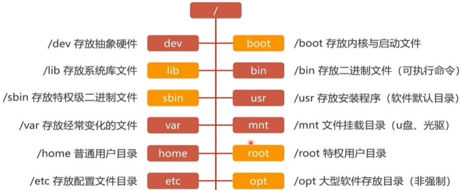
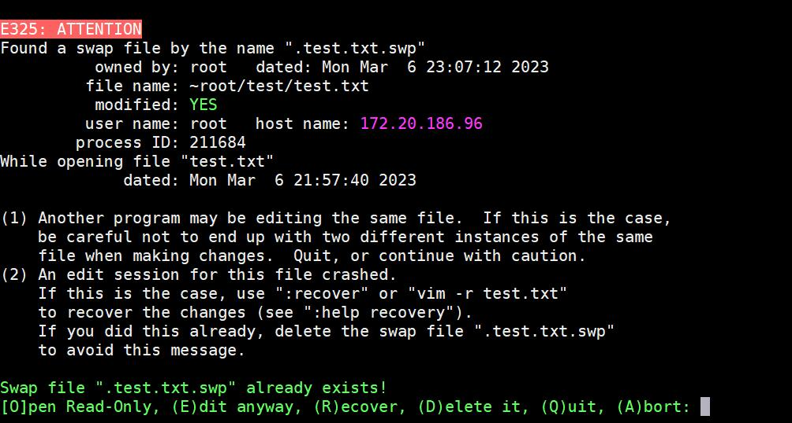
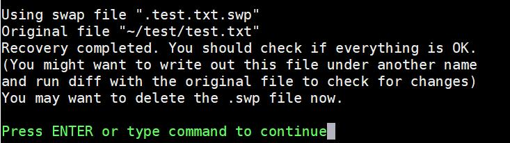
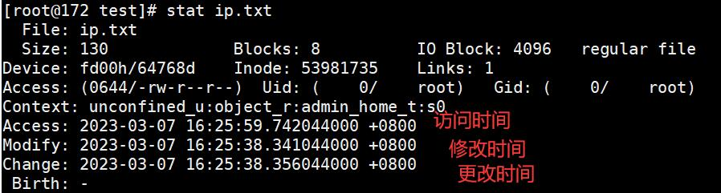
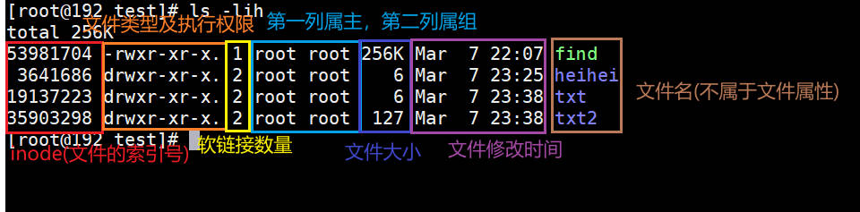
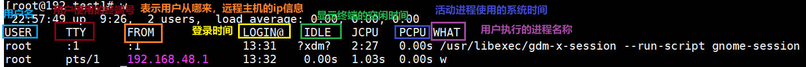
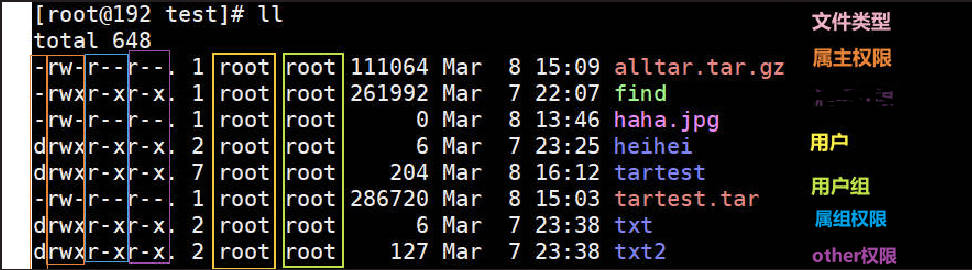
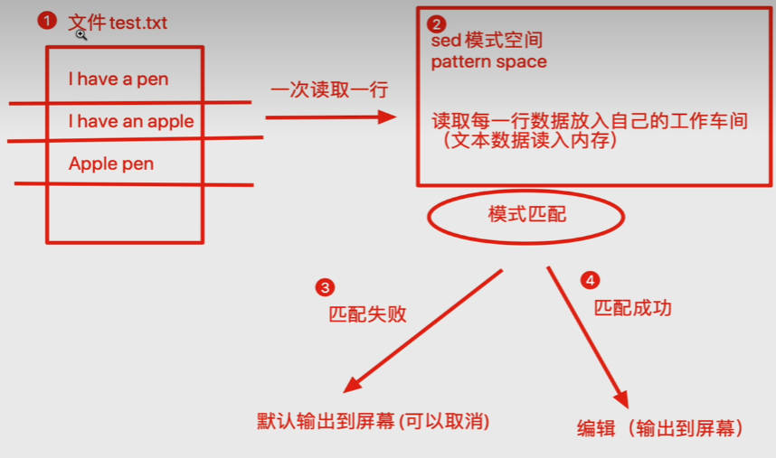
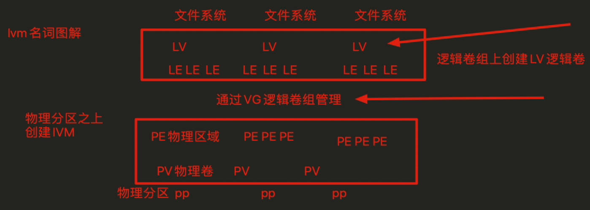

[TOC]


### Linux目录结构



### etc目录下的一些重要配置文件

+ /etc/sysconfig/network-scripts/ifcfg-eth0

  ```bash
  # [root@172 ~] root为登录用户 @后边的为hostname ~为工作目录
  [root@172 ~]# cat /etc/sysconfig/network-scripts/ifcfg-eth0
  TYPE=Ethernet
  PROXY_METHOD=none
  BROWSER_ONLY=no
  BOOTPROTO=dhcp
  DEFROUTE=yes
  IPV4_FAILURE_FATAL=no
  IPV6INIT=yes
  IPV6_AUTOCONF=yes
  IPV6_DEFROUTE=yes
  IPV6_FAILURE_FATAL=no
  IPV6_ADDR_GEN_MODE=stable-privacy
  NAME=eth0
  UUID=0c48eccf-0ad9-4f91-bb3f-7511149d3bc4
  DEVICE=eth0
  ONBOOT=no  // 系统自启联网配置项，值为yes时系统启动后会自动联网，为no时不会自动联网
  ```

  ​

+ /etc/resolv.conf

  /etc/resolv.conf是DNS客户机的配置文件，用于设置DNS服务器的IP地址及DNS域名，还包含了主机的域名搜索顺序。该文件是由域名解析器(resolver，一个根据主机名解析IP地址的库)使用的配置文件。它的格式比较简单，每行以一个关键字开头，后接一个或多个由空格隔开的参数。

  resolv.conf的关键字主要有4个，分别为：

  - nameserver：定义DNS服务器的IP地址

    表明DNS服务器的IP地址。可以有很多行的nameserver，每一个带一个IP地址。在查询时就按nameserver在本文件中的顺序进行，且只有当第一个nameserver没有反应时才查询下面的nameserver。

  - domain：定义本地域名

    声明主机的域名。很多程序用到它，如邮件系统；当为没有域名的主机进行DNS查询时，也要用到。如果没有域名，主机名将被使用，删除所有在第一个点( .)前面的内容。

  - search：定义域名的搜索列表

    它的多个参数指明域名查询顺序。当要查询没有域名的主机，主机将在由search声明的域中分别查找。domain和search不能共存；如果同时存在，后面出现的将会被使用。

  - sortlist：对返回的域名进行排序

    允许将得到域名结果进行特定的排序。它的参数为网络/掩码对，允许任意的排列顺序。


+ /etc/hosts

  /etc/hosts文件相当于给ip地址起别名

  ```bash
  [root@172 ~]# cat /etc/hosts
  127.0.0.1   localhost localhost.localdomain localhost4 localhost4.localdomain4
  ::1         localhost localhost.localdomain localhost6 localhost6.localdomain6
  127.0.0.1   me
  [root@172 ~]# ping me
  PING me (127.0.0.1) 56(84) bytes of data.
  64 bytes from localhost (127.0.0.1): icmp_seq=1 ttl=64 time=0.044 ms
  64 bytes from localhost (127.0.0.1): icmp_seq=2 ttl=64 time=0.074 ms
  64 bytes from localhost (127.0.0.1): icmp_seq=3 ttl=64 time=0.072 ms

  ```

+ /etc/motd

  登录后提示文件

  ```bash
  [root@shell ~ 16]# vi /etc/motd 
  ```


                          　　 へ　　　　　／|
                          　　/＼7　　　 ∠＿/
                          　 /　│　　 ／　／
                          　│　Z ＿,＜　／　　 /`ヽ
                          　│　　　　　ヽ　　 /　　〉
                          　 Y　　　　　`　 /　　/
                          　●　　●　　〈　　/
                          　()　 へ　　　　|　＼〈
                          　　> _　 ィ　 │ ／／
                          　 / へ　　 /　＜| ＼＼
                          　 ヽ_　　(_／　 │／／
                          　　7　　　　　　　|／
                          　　＞―r￣￣`―＿


  ```


+ /proc

  存放硬件信息相关的文件

  ```bash
  [root@172 ~]# cat /proc/cpuinfo
  processor       : 0
  vendor_id       : GenuineIntel
  cpu family      : 6
  model           : 183
  model name      : 13th Gen Intel(R) Core(TM) i5-13600K
  stepping        : 1
  microcode       : 0xffffffff
  cpu MHz         : 2318.470
  cache size      : 24576 KB
  physical id     : 0
  siblings        : 1
  core id         : 0
  cpu cores       : 1
  apicid          : 0
  initial apicid  : 0
  fpu             : yes
  fpu_exception   : yes
  cpuid level     : 28
  wp              : yes
  flags           : fpu vme de pse tsc msr pae mce cx8 apic sep mtrr pge mca cmov pat pse36 clflush mmx fxsr sse sse2 ss syscall nx pdpe1gb rdtscp lm constant_tsc rep_good nopl xtopology cpuid aperfmperf pni pclmulqdq ssse3 fma cx16 pcid sse4_1 sse4_2 movbe popcnt tsc_deadline_timer aes xsave avx f16c rdrand hypervisor lahf_lm abm 3dnowprefetch invpcid_single ssbd ibrs ibpb stibp ibrs_enhanced fsgsbase tsc_adjust bmi1 avx2 smep bmi2 erms invpcid rdseed adx smap clflushopt clwb sha_ni xsaveopt xsavec xgetbv1 xsaves umip waitpkg gfni vaes vpclmulqdq rdpid movdiri movdir64b flush_l1d arch_capabilities
  bugs            : spectre_v1 spectre_v2 spec_store_bypass swapgs
  bogomips        : 6988.80
  clflush size    : 64
  cache_alignment : 64
  address sizes   : 46 bits physical, 48 bits virtual
  power management:
  ```

### 基础命令

+ cd

  `cd`change directory的缩写，更改目录

  > 语法：cd  可选参数  文件夹
  >
  > 几个特殊目录
  >
  > . 当前工作目录
  >
  > ..上一级的工作目录
  >
  > -上次的工作目录
  >
  > ~当前系统登录的用户家目录

  ​

+ ls 

  list 列出文件夹中的内容

  > 语法：ls  [选项]  可选文件夹对象

  | 选项          | 含义                                       |
  | ----------- | ---------------------------------------- |
  | -a          | all的意思，显示出所有文件内容，以及隐藏文件                  |
  | -l          | 与ll作用相同，详细列出当前文件夹的内容                     |
  | -h          | 结合-l使用，以可阅读的形式输出文件大小                     |
  | --full-time | 以完整的时间格式输出                               |
  | -t          | 根据最后修改的时间排序文件                            |
  | -F          | 输出文件类型，以/结尾的就是目录，以*结尾的为可执行文件，以@结尾的为软连接，普通文件无特殊符号结尾 |
  | -d          | 只显示文件本身信息，不输出其中的内容                       |
  | -r          | reverse                                  |
  | -S          | 以文件大小进行排序，默认从大到小                         |
  | -i          | 显示文件的inode信息                             |

  ```bash
  [root@172 /]# ls
  bin  boot  dev  etc  home  lib  lib64  media  mnt  opt  proc  root  run  sbin  srv  sys  tmp  usr  var
  [root@172 /]# ls -l
  total 32
  lrwxrwxrwx.   1 root root     7 May 11  2019 bin -> usr/bin
  dr-xr-xr-x.   7 root root  4096 Dec 16  2021 boot
  drwxr-xr-x.  19 root root  3120 Feb 27 03:00 dev
  drwxr-xr-x. 164 root root 12288 Mar  5 15:43 etc
  drwxr-xr-x.   3 root root    29 Dec 17  2021 home
  lrwxrwxrwx.   1 root root     7 May 11  2019 lib -> usr/lib
  lrwxrwxrwx.   1 root root     9 May 11  2019 lib64 -> usr/lib64
  drwxr-xr-x.   2 root root     6 May 11  2019 media
  drwxr-xr-x.   2 root root     6 May 11  2019 mnt
  drwxr-xr-x.   2 root root     6 May 11  2019 opt
  dr-xr-xr-x. 256 root root     0 Feb 27 11:00 proc
  dr-xr-x---.  17 root root  4096 Mar  5 15:43 root
  drwxr-xr-x.  52 root root  1420 Mar  5 14:30 run
  lrwxrwxrwx.   1 root root     8 May 11  2019 sbin -> usr/sbin
  drwxr-xr-x.   2 root root     6 May 11  2019 srv
  dr-xr-xr-x.  13 root root     0 Feb 27 11:00 sys
  drwxrwxrwt.  15 root root  4096 Mar  5 15:59 tmp
  drwxr-xr-x.  12 root root   144 Dec 17  2021 usr
  drwxr-xr-x.  23 root root  4096 Dec 16  2021 var
  [root@172 /]# ll
  total 32
  lrwxrwxrwx.   1 root root     7 May 11  2019 bin -> usr/bin
  dr-xr-xr-x.   7 root root  4096 Dec 16  2021 boot
  drwxr-xr-x.  19 root root  3120 Feb 27 03:00 dev
  drwxr-xr-x. 164 root root 12288 Mar  5 15:43 etc
  drwxr-xr-x.   3 root root    29 Dec 17  2021 home
  lrwxrwxrwx.   1 root root     7 May 11  2019 lib -> usr/lib
  lrwxrwxrwx.   1 root root     9 May 11  2019 lib64 -> usr/lib64
  drwxr-xr-x.   2 root root     6 May 11  2019 media
  drwxr-xr-x.   2 root root     6 May 11  2019 mnt
  drwxr-xr-x.   2 root root     6 May 11  2019 opt
  dr-xr-xr-x. 256 root root     0 Feb 27 11:00 proc
  dr-xr-x---.  17 root root  4096 Mar  5 15:43 root
  drwxr-xr-x.  52 root root  1420 Mar  5 14:30 run
  lrwxrwxrwx.   1 root root     8 May 11  2019 sbin -> usr/sbin
  drwxr-xr-x.   2 root root     6 May 11  2019 srv
  dr-xr-xr-x.  13 root root     0 Feb 27 11:00 sys
  drwxrwxrwt.  15 root root  4096 Mar  5 15:59 tmp
  drwxr-xr-x.  12 root root   144 Dec 17  2021 usr
  drwxr-xr-x.  23 root root  4096 Dec 16  2021 var
  [root@172 /]# ls -lh
  total 32K
  lrwxrwxrwx.   1 root root    7 May 11  2019 bin -> usr/bin
  dr-xr-xr-x.   7 root root 4.0K Dec 16  2021 boot
  drwxr-xr-x.  19 root root 3.1K Feb 27 03:00 dev
  drwxr-xr-x. 164 root root  12K Mar  5 15:43 etc
  drwxr-xr-x.   3 root root   29 Dec 17  2021 home
  lrwxrwxrwx.   1 root root    7 May 11  2019 lib -> usr/lib
  lrwxrwxrwx.   1 root root    9 May 11  2019 lib64 -> usr/lib64
  drwxr-xr-x.   2 root root    6 May 11  2019 media
  drwxr-xr-x.   2 root root    6 May 11  2019 mnt
  drwxr-xr-x.   2 root root    6 May 11  2019 opt
  dr-xr-xr-x. 256 root root    0 Feb 27 11:00 proc
  dr-xr-x---.  17 root root 4.0K Mar  5 15:43 root
  drwxr-xr-x.  52 root root 1.4K Mar  5 14:30 run
  lrwxrwxrwx.   1 root root    8 May 11  2019 sbin -> usr/sbin
  drwxr-xr-x.   2 root root    6 May 11  2019 srv
  dr-xr-xr-x.  13 root root    0 Feb 27 11:00 sys
  drwxrwxrwt.  15 root root 4.0K Mar  5 15:59 tmp
  drwxr-xr-x.  12 root root  144 Dec 17  2021 usr
  drwxr-xr-x.  23 root root 4.0K Dec 16  2021 var
  [root@172 /]# ls --full-time
  total 32
  lrwxrwxrwx.   1 root root     7 2019-05-11 08:33:06.000000000 +0800 bin -> usr/bin
  dr-xr-xr-x.   7 root root  4096 2021-12-16 20:49:27.112658600 +0800 boot
  drwxr-xr-x.  19 root root  3120 2023-02-27 03:00:42.453944400 +0800 dev
  drwxr-xr-x. 164 root root 12288 2023-03-05 15:43:35.728158700 +0800 etc
  drwxr-xr-x.   3 root root    29 2021-12-17 04:41:08.129000000 +0800 home
  lrwxrwxrwx.   1 root root     7 2019-05-11 08:33:06.000000000 +0800 lib -> usr/lib
  lrwxrwxrwx.   1 root root     9 2019-05-11 08:33:06.000000000 +0800 lib64 -> usr/lib64
  drwxr-xr-x.   2 root root     6 2019-05-11 08:33:06.000000000 +0800 media
  drwxr-xr-x.   2 root root     6 2019-05-11 08:33:06.000000000 +0800 mnt
  drwxr-xr-x.   2 root root     6 2019-05-11 08:33:06.000000000 +0800 opt
  dr-xr-xr-x. 256 root root     0 2023-02-27 11:00:26.003000000 +0800 proc
  dr-xr-x---.  17 root root  4096 2023-03-05 15:43:40.073158700 +0800 root
  drwxr-xr-x.  52 root root  1420 2023-03-05 14:30:48.818158700 +0800 run
  lrwxrwxrwx.   1 root root     8 2019-05-11 08:33:06.000000000 +0800 sbin -> usr/sbin
  drwxr-xr-x.   2 root root     6 2019-05-11 08:33:06.000000000 +0800 srv
  dr-xr-xr-x.  13 root root     0 2023-02-27 11:00:35.148884400 +0800 sys
  drwxrwxrwt.  15 root root  4096 2023-03-05 16:30:04.547158700 +0800 tmp
  drwxr-xr-x.  12 root root   144 2021-12-17 04:33:32.700000000 +0800 usr
  [root@172 /]# ls -lt
  total 32
  drwxrwxrwt.  15 root root  4096 Mar  5 16:30 tmp
  dr-xr-x---.  17 root root  4096 Mar  5 15:43 root
  drwxr-xr-x. 164 root root 12288 Mar  5 15:43 etc
  drwxr-xr-x.  52 root root  1420 Mar  5 14:30 run
  dr-xr-xr-x.  13 root root     0 Feb 27 11:00 sys
  dr-xr-xr-x. 256 root root     0 Feb 27 11:00 proc
  drwxr-xr-x.  19 root root  3120 Feb 27 03:00 dev
  drwxr-xr-x.   3 root root    29 Dec 17  2021 home
  drwxr-xr-x.  12 root root   144 Dec 17  2021 usr
  dr-xr-xr-x.   7 root root  4096 Dec 16  2021 boot
  drwxr-xr-x.  23 root root  4096 Dec 16  2021 var
  lrwxrwxrwx.   1 root root     7 May 11  2019 bin -> usr/bin
  lrwxrwxrwx.   1 root root     7 May 11  2019 lib -> usr/lib
  lrwxrwxrwx.   1 root root     9 May 11  2019 lib64 -> usr/lib64
  drwxr-xr-x.   2 root root     6 May 11  2019 media
  drwxr-xr-x.   2 root root     6 May 11  2019 mnt
  drwxr-xr-x.   2 root root     6 May 11  2019 opt
  lrwxrwxrwx.   1 root root     8 May 11  2019 sbin -> usr/sbin
  drwxr-xr-x.   2 root root     6 May 11  2019 srv
  [root@172 /]# ls -F
  bin@  boot/  dev/  etc/  home/  lib@  lib64@  media/  mnt/  opt/  proc/  root/  run/  sbin@  srv/  sys/  tmp/  usr/  var/
  ```

+ su

  `su - username` 切换用户名

  exit可退出用户登录

  ```bash
  [root@172 ~]# pwd
  /root
  [root@172 ~]# ls -a /opt/
  .  ..
  [root@172 ~]# su - chitanda-xiaolu
  [chitanda-xiaolu@172 ~]$ pwd
  /home/chitanda-xiaolu
  [chitanda-xiaolu@172 ~]$ ls /opt/
  [chitanda-xiaolu@172 ~]$ ls -a /opt/
  .  ..
  ```

+ mkdir


  创建文件夹(目录)

  > 语法：mkdir  [选项]  文件夹名称(目录)

  ```bash
  # mkdir 文件夹名称  新建一个文件夹
  [root@172 ~]# ls
  anaconda-ks.cfg  Desktop  Documents  Downloads  initial-setup-ks.cfg  linux_shell  Music  Pictures  Public  Templates  Videos
  [root@172 ~]# mkdir test
  [root@172 ~]# ls
  anaconda-ks.cfg  Desktop  Documents  Downloads  initial-setup-ks.cfg  linux_shell  Music  Pictures  Public  Templates  test  Videos

  # mkdir {dir1,dir2,dir3} 在当前路径新建dir1、dir2、dir3三个目录
  [root@172 test]# ls
  [root@172 test]# mkdir {dir1,dir2,dir3}
  [root@172 test]# ls
  dir1  dir2  dir3

  # mkdir -p  递归创建文件夹
  [root@172 test]# ls
  dir1  dir2  dir3
  [root@172 test]# mkdir -p dir1/dir11/dir12
  [root@172 test]# ls dir1
  dir11
  [root@172 test]# ls dir1/dir11/
  dir12
   
  # mkdir {1..100} 创建100个目录
  [root@172 test]# ls
  dir1    dir14  dir2   dir25  dir30  dir36  dir41  dir47  dir52  dir58  dir63  dir69  dir74  dir8   dir85  dir90  dir96
  dir10   dir15  dir20  dir26  dir31  dir37  dir42  dir48  dir53  dir59  dir64  dir7   dir75  dir80  dir86  dir91  dir97
  dir100  dir16  dir21  dir27  dir32  dir38  dir43  dir49  dir54  dir6   dir65  dir70  dir76  dir81  dir87  dir92  dir98
  dir11   dir17  dir22  dir28  dir33  dir39  dir44  dir5   dir55  dir60  dir66  dir71  dir77  dir82  dir88  dir93  dir99
  dir12   dir18  dir23  dir29  dir34  dir4   dir45  dir50  dir56  dir61  dir67  dir72  dir78  dir83  dir89  dir94
  dir13   dir19  dir24  dir3   dir35  dir40  dir46  dir51  dir57  dir62  dir68  dir73  dir79  dir84  dir9   dir95

  ```

+ touch

  >创建普通文件
  >
  >语法：touch [选项] 文件名称
  >
  >-t 修改文件的时间

  ```bash
  [root@172 test]# ls
  [root@172 test]# touch test.txt
  [root@172 test]# ls
  test.txt

  # 创建文件名后缀为1-10的txt文件
  [root@172 test]# touch test{1..10}.txt
  [root@172 test]# ls
  test10.txt  test1.txt  test2.txt  test3.txt  test4.txt  test5.txt  test6.txt  test7.txt  test8.txt  test9.txt  test.txt

  # 创建文件后缀为字母a-z的txt文件
  [root@172 test]# touch test_{a..z}.txt
  [root@172 test]# ls
  test_a.txt  test_d.txt  test_g.txt  test_j.txt  test_m.txt  test_p.txt  test_s.txt  test_v.txt  test_y.txt
  test_b.txt  test_e.txt  test_h.txt  test_k.txt  test_n.txt  test_q.txt  test_t.txt  test_w.txt  test_z.txt
  test_c.txt  test_f.txt  test_i.txt  test_l.txt  test_o.txt  test_r.txt  test_u.txt  test_x.tx

  ```

+ cp

  > 复制文件
  >
  > 语法：cp  [选项]  要复制的文件  复制之后的文件名
  >
  > -r 递归复制目录，即复制目录下的所有级的子目录及文件
  >
  > -d 复制的时候保持软连接
  >
  > -p 等于--preserve=模式，所有权，时间戳，复制文件保持源文件的权限、时间属性
  >
  > -i  --interactive  覆盖前询问提示，默认系统做了alias别名功能，让我们输入cp的时候，其实是cp -i
  >
  > -f  强制复制

  ```bash
  # 复制文件
  [root@172 test]# cp test_a.txt ./test
  [root@172 test]# ls ./test
  test_a.txt

  # 复制且改名
  [root@172 test]# ls ./test
  test_a.txt
  [root@172 test]# cp ./test_b.txt ./test/test_bb.txt
  [root@172 test]# ls test
  test_a.txt  test_bb.txt

  # 复制多个文件
  [root@172 test]# cp test_c.txt test_d.txt test_e.txt ./test
  [root@172 test]# ls test
  test_a.txt  test_bb.txt  test_c.txt  test_d.txt  test_e.txt
  ```

  ​

+ mv

  > 移动或重命名文件
  >
  > 语法：mv [选项]  旧文件名  新文件名
  >
  > -i 覆盖前询问，默认系统做了alias别名功能，让我们输入mv的时候，其实是mv -i
  >
  > -f 覆盖前不询问

  ```bash
  # 移动文件
  [root@172 test]# ls
  test        test_c.txt  test_f.txt  test_i.txt  test_l.txt  test_o.txt  test_r.txt  test_u.txt  test_x.txt
  test_a.txt  test_d.txt  test_g.txt  test_j.txt  test_m.txt  test_p.txt  test_s.txt  test_v.txt  test_y.txt
  test_b.txt  test_e.txt  test_h.txt  test_k.txt  test_n.txt  test_q.txt  test_t.txt  test_w.txt  test_z.txt
  [root@172 test]# mv test_z.txt ./test
  [root@172 test]# ls
  test        test_c.txt  test_f.txt  test_i.txt  test_l.txt  test_o.txt  test_r.txt  test_u.txt  test_x.txt
  test_a.txt  test_d.txt  test_g.txt  test_j.txt  test_m.txt  test_p.txt  test_s.txt  test_v.txt  test_y.txt
  test_b.txt  test_e.txt  test_h.txt  test_k.txt  test_n.txt  test_q.txt  test_t.txt  test_w.txt
  [root@172 test]# ls test
  test_a.txt  test_bb.txt  test_c.txt  test_d.txt  test_e.txt  test_z.txt
  # 将text_c.txt复制到test目录下且改名
  [root@172 test]# mv test_c.txt ./test/test_c1.txt

   [root@172 test]# ls

    test        test_d.txt  test_g.txt  test_j.txt  test_m.txt  test_p.txt  test_s.txt  test_v.txt  test_y.txt

    test_a.txt  test_e.txt  test_h.txt  test_k.txt  test_n.txt  test_q.txt  test_t.txt  test_w.txt

    test_b.txt  test_f.txt  test_i.txt  test_l.txt  test_o.txt  test_r.txt  test_u.txt  test_x.txt

    [root@172 test]# ls test

    test_a.txt  test_bb.txt  test_c1.txt  test_c.txt  test_d.txt  test_e.txt  test_z.txt

  ```

+ rm 

  删除文件或者目录

  >语法：rm [选项]  文件名或文件夹名
  >
  >-f  强制删除
  >
  >-i  删除前需要确认
  >
  >-I  删除超过三个文件或者递归删除前要求确认
  >
  >-d 删除空目录
  >
  >-r  递归删除目录及其内容
  >
  >-v  详细显示进行的步骤

  ​

+ man

  查看某个命令的使用文档

  > ​
  >
  > 语法：man  命令(如ls  rm  mv等)
  >
  > 也可以使用命令 --help、info  命令的形势查看命令的使用方式


### linux开关机命令

+ 重启

  ```bash
  reboot
  shutdown -r # 重启
  shutdown -r 10 # 十分钟后重启
  shutdown -r 0 # 立即重启
  shutdown -r now # 立即重启
  ```


+ 关机

  ​

  ```bash
  shutdown -h  # 关机
  shutdown -r # 十分钟后关机
  shutdown -r 0 # 立即关机
  shutdown -r now # 立即关机
  ```

### linux常用快捷键

> ctrl + c  取消当前操作
>
> ctrl + l 清空屏幕内容
>
> ctrl + d 对出当前用户
>
> ctrl + a 光标移到行首
>
> ctrl + e 光标移到行尾
>
> ctrl + u 删除光标到行首的内容
>
> #MobaXterm
>
> HOME 将命令光标移至行首
>
> END 将命令行光标移至行尾

### vim快捷键

移动光标快捷键

```
w 移动到下一个单词
b 移动到上一个单词

数字0 移动到行首
字符$ 移动到行尾
g 移动到文章开头
G 移动到文章结尾
H 移动到屏幕的开头
L 移动到屏幕的结尾
M 移动到屏幕的中间

```

命令模式的查找

```
向下查找： /你要查找的内容
		 /love 查找love相关的信息，按n跳转到下一个单词

向上查找： ?你要查找的内容
		 ?the 查找the相关的内容，n寻找下一个单词 
```

命令行模式下的复制，粘贴，删除

```
输入 yy 复制光标所在行
输入 4yy 复制4行内容
输入 p 粘贴
输入 dd 删除光标当前行
输入 D 删除光标当前位置到行尾的内容
输入 x 删除光标当前字符，向后删除
输入 x 删除光标当前字符，向前删除
输入 u 撤销上一步的动作
```

快捷操作

```
出入 C 删除光标所在位置到行尾的内容，且进入编辑模式
输入 o 在当前光标的下一行开始编辑
输入 O 在光标的上一行开始编辑
输入 A 快速进入行尾，且进入编辑模式
输入 zz 快速保存退出

```

批量快捷操作

```
快捷删除步骤：

1. 输入ctrl + v进入可视块模式
2. 用上下左右命令，选择你操作的块
3. 选中块后，输入d，删除块内容

快捷插入：

1. 选中块后，输入大写I，进行代码编写
2. 按两下esc会自动生成多行代码

```

文件处于编辑状态时，当终端异常关闭时会生成.swp文件，在对进行编辑会出现编辑异常

```bash
[root@172 test]# ls
test.txt
[root@172 test]# ls -a
.  ..  test.txt  .test.txt.swp
```



解决方法如下：

```bash
[root@172 test]# vim -r .test.txt.swp
```



```bash
[root@172 test]# rm -rf .test.txt.swp
```

删除.test.txt.swp之后即可对test.txt进行编辑

### 重定向

| 重定向符号 | 解释      |
| ----- | ------- |
| >     | 输出覆盖重定向 |
| >>    | 输出追加重定向 |
| <或<<  | 标准输入重定向 |

```bash
[root@172 test]# echo kiana > dacapo.txt
[root@172 test]# cat dacapo.txt
kiana
[root@172 test]# cat < dacapo.txt
kiana
[root@172 test]# xargs -n 4 < number.txt
1 2 3 4
5 6 7 8
9 10
[root@172 test]# xargs -n 3 < number.txt
1 2 3
4 5 6
7 8 9
10

[root@172 test]# ls
dacapo.txt  number.txt  test.txt
[root@172 test]# cat >> slogan.txt << EOF
> 为世界上所有美好而战！~
> May you,the beauty of this world,always shine.
> EOF
[root@172 test]# cat slogan.txt
为世界上所有美好而战！~
May you,the beauty of this world,always shine.

```

在Linux系统中，一切设备都看做文件

而每打开一个文件，就有一个代表该打开文件的文件描述

程序启动时默认打开三个I/O设备文件：

+ 标准输入文件stdin，文件描述符为0
+ 标准输出文件stdout，文件描述为1
+ 标准错误输出文件stderr，文件描述为2

### cat

> 读取并输出文件内容
>
> 用法: cat [选项]  文件名
>
> -n 显示每一行的行号
>
> -b 对非空行进行编号并输出
>
> -E 显示出每一行航模隐藏的$
>
> -s 减少空行数量，多个空行减为1个

| 命令          | 功能                                 |
| ----------- | ---------------------------------- |
| 查看文件内容      | cat file.txt                       |
| 合并多个文件的内容   | cat file.txt file2.txt > file3.txt |
| 非交互式编辑或追加内容 | cat >> file.txt << EOF 要输入的内容 EOF  |
| 清空文件        | cat /dev/null > file.txt           |

```bash
[root@172 test]# cat dacapo.txt slogan.txt > slogan2.txt
[root@172 test]# cat slogan2.txt
kiana
为世界上所有美好而战！~
May you,the beauty of this world,always shine.

# 清空文件，清空文件还是直接使用> slogan2.txt，文件会被直接清空不留空行
[root@172 test]# cat /dev/null > slogan2.txt
[root@172 test]# cat slogan2.txt

#echo > slogan2.txt也可以清空文件，但是会留空行
```

### tac

> 与cat类似可读取文件内容，读取内容与cat顺序相反

### more less

用于分屏显示大文本内容

> 按下enter查看下一行
>
> 空格是向下滚动一个屏大小
>
> =显示当前行号
>
> 按下q 是退出more

### head tail

> head命令用于查看文件开头的n行
>
> head -5 file.txt  #查看file.txt的前5行
>
> head -c 5 file.txt  # 输出file.txt中的5个字符

tail默认从后向前看10行，也可以指定行数

```bash
tail 文件名 # 默认显示后10行
tail -2 文件名 # 显示后2行
tail -f 实时检测文件内容变化，文件不存在时无法检测，可用于实时查看日志
tail -F 实时检测文件内容变化，可检测不存在的文件
```

### cut

> 语法: cut 【选项】【数值区间】文件
>
> -b 以字节为单位分割字符
>
> -n 取消分割多字节字符，与-b一起用
>
> -c 以字符为单位
>
> -d 自定义分隔符，默认以tab为分隔符
>
> -f 与-d一起使用，指定显示绑定哪个区域

```bash
# 截取file.txt中每一行的第四个字符
cut -c 4 file.txt

# 截取4-6个字符
cut -c 4-6 file.txt

# 截取第5个字符和第7个字符
cut -c 5,7 file.txt

# 截取每一行第4个字符以后的所有字符
cut -c 4- file.txt

# 截每一行开头至第6个字符的所有字符
cut -c -6 file.txt

# 截取以:为分隔符的第3个域
cut -d ": " -f 4 file.txt
```

### sort

sort命令将输入文件内容按照规则排序，然后输出结果

> 语法： sort 【选项】文件名
>
> -b 忽略前导的空白区域
>
> -n 根据字符串的数值进行比价
>
> -r 逆序输出排序结果
>
> -t 使用指定分隔符代替非空格到空格的转换
>
> -u 去重排序
>
> -k 指定要进行比较的域

```bash
# 对ip地址的第四组值进行排序
[root@172 test]# cat ip.txt
10.0.0.1
10.0.0.212
10.0.0.22
10.0.0.23
10.0.0.4
10.0.0.44
[root@172 test]# cat ip.txt  | sort -n -t. -k4
10.0.0.1
10.0.0.4
10.0.0.22
10.0.0.23
10.0.0.44
10.0.0.212
```

### uniq

uniq命令可以输出或者忽略文件的重复行，常与sort排序结合使用

>语法: uniq [选项] 文件名
>
>-c 在每行前加上表示相应行出现的次数
>
>-d 只输出重复行
>
>-u 只显示出现过一次的行

```bash
# 去除重复的行
[root@172 test]# cat ip.txt
10.0.0.1
10.0.0.1
10.0.0.1
10.0.0.212
10.0.0.212
10.0.0.212
10.0.0.212
10.0.0.22
10.0.0.23
10.0.0.23
10.0.0.23
10.0.0.4
10.0.0.44
[root@172 test]# uniq ip.txt
10.0.0.1
10.0.0.212
10.0.0.22
10.0.0.23
10.0.0.4
10.0.0.44

# 统计每行出现的次数
[root@172 test]# uniq -c ip.txt
      3 10.0.0.1
      4 10.0.0.212
      1 10.0.0.22
      3 10.0.0.23
      1 10.0.0.4
      1 10.0.0.44
# 统计重复行出现的次数
[root@172 test]# uniq -c -d ip.txt
      3 10.0.0.1
      4 10.0.0.212
      3 10.0.0.23
# 统计只出现过一次的行
[root@172 test]# uniq -c -u ip.txt
      1 10.0.0.22
      1 10.0.0.4
      1 10.0.0.44

```

### wc 

wc用于统计文件的行数、单词数、字节数

> -c 打印字节数
>
> -m 打印字符数
>
> -l 打印行数
>
> -L 打印最长行的字符长度
>
> -w 打印单词数

```bash
# 统计行数
[root@172 test]# wc -l ip.txt
13 ip.txt

# 统计单词数量
[root@172 test]# echo "kiana bronya" | wc -w
2

# 统计字符数量，
[root@172 test]# echo "abc d" | wc -m
6 # 字符串结尾都会有个隐藏的$符，因此统计结果为6

#打印最长行的字符长度
[root@172 test]# cat ip.txt
10.0.0.1
10.0.0.1
10.0.0.1
10.0.0.212
10.0.0.212
10.0.0.212
10.0.0.212
10.0.0.22
10.0.0.23
10.0.0.23
10.0.0.23
10.0.0.4
10.0.0.44
[root@172 test]# wc -L ip.txt
10 ip.txt

```

### tr

tr命令从标准输入中替换、缩减或删除字符，将结果写入到标准输出

> 语法：tr [选项] 
>
> -c 取代所有不属于第一字符集的字符
>
> -d 删除所有属于第一字符集的字符
>
> -s 把连续重复的字符以单独一个字符表示
>
> -t 先删除第一字符集较第二字符集多出的字符

```bash
# 将小写替换为大写
[root@172 test]# echo "kiana" | tr '[a-z]' '[A-Z]'
KIANA

# 删除所有字母
[root@172 test]# echo "a b cd 123" | tr -d 'a-z'
   123

# 删除所有数字
[root@172 test]# echo "a b cd 123" | tr -d '1-9'
a b cd

# 删除连续重复字符
[root@172 test]# echo "aa ddddddd  bbbd" | tr -s 'ad'
a d  bbbd
[root@172 test]# echo "aa ddddddd  bbbd" | tr -s 'ab'
a ddddddd  bd
[root@172 test]# echo "aa ddddddd  bbbd" | tr -s 'abd'
a d  bd
```

### stat



### find

find命令用来在指定目录下查找文件。任何位于参数之前的字符串都将被视为欲查找的目录名。

如果使用该命令时，不设置任何参数，则find命令将在当前目录下查找子目录与文件。

> find 路径 [选项] 输出形势

| 参数              | 含义                                       |
| --------------- | ---------------------------------------- |
| -maxdepath      | 设置最大目录层级                                 |
| -mindepath      | 设置最小目录层级                                 |
| -type           | 指定寻找文件的类型(f为普通文件 d文件夹)                   |
| -atiem          | 按照文件访问access的时间查找，单位是天                   |
| -ctime          | 按照文件改变change状态来查找文件，单位是天                 |
| -mtime          | 根据文件修改modify时间来查文件                       |
| -name           | 指定查找文件的名称                                |
| -group          | 按照文件所属组查找                                |
| -perm           | 按照文件的权限查找                                |
| -size n[cwbkMG] | 按照文件大小为n个后缀决定的数据块。b：代表512位元组的块；c：表示字节数；k：表示kilo bytes；w：字(2字节)；M：兆字节；G：千兆字节 |
| !               | 取反                                       |
| -path           | 配合-prune参数排除指定目录                         |
| -prune          | 使find命令不在指定目录内查找                         |
| -exec或-ok       | 对匹配的文件执行相应shell命令                        |
| -a -o           | 取交集、并集                                   |

-atime -2 搜索在1天内被访问过的文件

-atime 2 搜索恰好在2天前被访问过的文件

-atime +2 超过2天被访问的文件

-size +50M 搜索大于50m的文件

```bash
# 查找所有非普通文件的文件
[root@172 test]# mkdir heihei
[root@172 test]# find . ! -type f
.
./heihei

# 查找出heihei文件夹内，所有的txt文件
[root@172 test]# find . -path "./heihei" -prune -o -name "*.txt"
./test.txt
./dacapo.txt
./number.txt
./slogan.txt
./slogan2.txt
./ip.txt
./heihei
[root@172 test]# find . -path "./heihei" -prune -o -name "*.txt"  -print
./test.txt
./dacapo.txt
./number.txt
./slogan.txt
./slogan2.txt
./ip.txt

# 寻找所有txt文件，找到后并询问用户是否删除
[root@172 test]# find . -name "*.txt" -type f -ok rm {} \;
< rm ... ./test.txt > ? n
< rm ... ./dacapo.txt > ? n
< rm ... ./number.txt > ? n
< rm ... ./slogan.txt > ? n
< rm ... ./slogan2.txt > ? n
< rm ... ./ip.txt > ? n
< rm ... ./heihei/heihei.txt > ? n

```

### xargs

xargs又称管道命令

是给命令传递参数的一个过滤器，也是组合多个命令的一个工具它把一个数据流分割为一些足够小的块，以方便过滤器和命令进行处理

> xargs [选项]

| 参数     | 含义                                     |
| ------ | -------------------------------------- |
| -d     | 为输入指定一个分隔符，默认分隔符为空格                    |
| -i     | 用{}代替传递的数据                             |
| -I     | 使用方式xargs I val，I可以声明一个变量，这个变量会接受传入的数据 |
| -n     | 选项限制单个命令行的参数                           |
| -t     | 显示执行详情                                 |
| -p     | 交互模式                                   |
| -P n   | 允许的最大线程数量为n                            |
| -s[大小] | 设置传递参数的最大字节数                           |
| -x     | 大于-s设置的最大长度结束                          |
| -0     |                                        |

```bash
[root@172 test]# cat number.txt
1
2
3
4
5
6
7
8
9
10
[root@172 test]# xargs < number.txt
1 2 3 4 5 6 7 8 9 10

[root@172 test]# xargs -n 2 < number.txt
1 2
3 4
5 6
7 8
9 10

[root@172 test]# echo "heihei,hahaha" | xargs -d,
heihei hahaha

# 将所有txt文件移入txt文件夹中，-i {}表示标准输入中的所有数据
[root@172 test]# ls
dacapo.txt  find  heihei  ip.txt  number.txt  slogan2.txt  slogan.txt  test.txt  txt
[root@172 test]# find . -name "*.txt" | xargs -i mv {} txt/
[root@172 test]# ls txt
dacapo.txt  heihei.txt  ip.txt  number.txt  slogan2.txt  slogan.txt  test.txt

# 将txt中所有的txt文件移入txt2中，下例的file代表find ./txt -name "*.txt"找到的txt文件，即xargs的标准
[root@172 test]# ls
find  heihei  txt  txt2
[root@172 test]# find ./txt -name "*.txt" | xargs -I file mv file ./txt2
[root@172 test]# ls txt2
dacapo.txt  heihei.txt  ip.txt  number.txt  slogan2.txt  slogan.txt  test.txt
[root@172 test]# ls txt

```

### 文件属性



错误：第三列为硬链接数量

### 文件类型

可以通过`ls -F` 给文件结尾加上特殊标识符


| 符号   | 类型                      |
| ---- | ----------------------- |
| -    | 普通文件(二进制文件、图片、日志、txt)   |
| d    | 文件夹(目录)                 |
| b    | 块设备文件，终端/dev/sda1，硬盘，光驱 |
| c    | 设备文件，终端/dev/tty1，网络串口文件 |
| s    | 套接字文件，进程通信(socket)文件    |
| p    | 管道文件pipe                |
| l    | 链接文件，link类型，快捷方式        |
|      |                         |

### tar gzip zip

tar用于打包文件

> tar [选项] 参数

| 选项        | 含义                   |
| --------- | -------------------- |
| -A        | 新增文件到已存储的备份文件(压缩文件)  |
| -B        | 设置区块大小               |
| -c        | 建立新的备份文件(压缩文件)，即打包   |
| -d        | 记录文件的差别              |
| -x        | 从备份文件中还原文件           |
| -t        | 列出备份文件的内容            |
| -z        | 通过gzip指定对文件进行压缩      |
| -Z        | 通过conpress指令处理备份文件   |
| -f        | 指定备份文件               |
| -v        | 显示命令执行过程             |
| -r        | 添加文件到已压缩的文件          |
| -u        | 添加改变了和现有的文件到已存在的压缩文件 |
| -j        | 支持bzip2解压文件          |
| -l        | 文件系统边界设置             |
| -k        | 保留原有文件不覆盖            |
| -m        | 保留文件不被覆盖             |
| -w        | 确认压缩文件的正确性           |
| -p        | 用原来的文件权限还原文件         |
| --exclude | 指定不进行处理的文件           |

```bash
# 压缩当前目录下的所有文件，并将压缩包命名为tartest.tar
[root@192 tartest]# tar -cvf tartest.tar ./*
./dacapo.txt
./find
./haha.jpg
./heihei/
./heihei.txt
./ip.txt
./number.txt
./slogan2.txt
./slogan.txt
./tartest/
./tartest/tartest/
./test.txt
./txt/
./txt2/
./txt2/heihei.txt
./txt2/slogan2.txt
./txt2/ip.txt
./txt2/number.txt
./txt2/dacapo.txt
./txt2/test.txt
./txt2/slogan.txt
[root@192 tartest]# ls
dacapo.txt  find  haha.jpg  heihei  heihei.txt  ip.txt  number.txt  slogan2.txt  slogan.txt  tartest  tartest.tar  test.txt  txt  txt2

# 打包并压缩，xxxx.tar.gz中的tar指用tar压缩，gz指用gzip压缩文件
[root@192 tartest]# tar -czvf alltar.tar.gz ./
./
./dacapo.txt
./find
./haha.jpg
./heihei/
./heihei.txt
./ip.txt
./number.txt
./slogan2.txt
./slogan.txt
./tartest/
./tartest/tartest/
./test.txt
./txt/
./txt2/
./txt2/heihei.txt
./txt2/slogan2.txt
./txt2/ip.txt
./txt2/number.txt
./txt2/dacapo.txt
./txt2/test.txt
./txt2/slogan.txt
tar: .: file changed as we read it
[root@192 tartest]# ls
alltar.tar.gz  find      heihei      ip.txt      slogan2.txt  tartest   txt
dacapo.txt     haha.jpg  heihei.txt  number.txt  slogan.txt   test.txt  txt2

# 解压xxx.tar.gz，因为gz文件所欲需要用到-z，-x解压tar打包的文件。-f指定要解压的文件
[root@192 tartest]# tar -zxvf ../alltar.tar.gz ./
./
./dacapo.txt
./find
./haha.jpg
./heihei/
./heihei.txt
./ip.txt
./number.txt
./slogan2.txt
./slogan.txt
./tartest/
./tartest/tartest/
./test.txt
./txt/
./txt2/
./txt2/heihei.txt
./txt2/slogan2.txt
./txt2/ip.txt
./txt2/number.txt
./txt2/dacapo.txt
./txt2/test.txt
./txt2/slogan.txt
[root@192 tartest]# ls
dacapo.txt  find  haha.jpg  heihei  heihei.txt  ip.txt  number.txt  slogan2.txt  slogan.txt  tartest  test.txt  txt  txt2

# 查看压缩包中的文件
[root@192 tartest]# tar -ztf ../alltar.tar.gz
./
./dacapo.txt
./find
./haha.jpg
./heihei/
./heihei.txt
./ip.txt
./number.txt
./slogan2.txt
./slogan.txt
./tartest/
./tartest/tartest/
./test.txt
./txt/
./txt2/
./txt2/heihei.txt
./txt2/slogan2.txt
./txt2/ip.txt
./txt2/number.txt
./txt2/dacapo.txt
./txt2/test.txt
./txt2/slogan.txt

# 只解压指定文件
[root@192 tartest]# ls
[root@192 tartest]# tar -zxvf ../alltar.tar.gz ./slogan2.txt
./slogan2.txt
[root@192 tartest]# ls
slogan2.txt

# 解压除haha.jpg以外的所有文件
[root@192 tartest]# tar -zxvf ../alltar.tar.gz --exclude haha.jpg ./
./
./dacapo.txt
./find
./heihei/
./heihei.txt
./ip.txt
./number.txt
./slogan2.txt
./slogan.txt
./tartest/
./tartest/tartest/
./test.txt
./txt/
./txt2/
./txt2/heihei.txt
./txt2/slogan2.txt
./txt2/ip.txt
./txt2/number.txt
./txt2/dacapo.txt
./txt2/test.txt
./txt2/slogan.txt
[root@192 tartest]# ls
dacapo.txt  find  heihei  heihei.txt  ip.txt  number.txt  slogan2.txt  slogan.txt  tartest  test.txt  txt  txt2

# 压缩软件链接指定的文件
tar -zchf xxx.tar.gz ./file_name.txt
```

**gzip**用于压缩文件，gzip无法对文件进行压缩，必须先tar对文件夹打包后，才可以gzip压缩

> gzip 要压缩的文件

**zip** 是一个应用广泛的跨平台压缩工具，压缩文件后缀为zip

> 压缩：zip 压缩包名  压缩文件
>
> 解压：uzip 压缩包

```bash
[root@192 tartest]# zip allzip.zip ./*
  adding: dacapo.txt (stored 0%)
  adding: find (deflated 58%)
  adding: heihei/ (stored 0%)
  adding: heihei.txt (stored 0%)
  adding: ip.txt (deflated 80%)
  adding: number.txt (stored 0%)
  adding: slogan2.txt (stored 0%)
  adding: slogan.txt (stored 0%)
  adding: tartest/ (stored 0%)
  adding: test.txt (deflated 43%)
  adding: txt/ (stored 0%)
  adding: txt2/ (stored 0%)
[root@192 unzip]# unzip allzip.zip
Archive:  allzip.zip
 extracting: dacapo.txt
  inflating: find
   creating: heihei/
 extracting: heihei.txt
  inflating: ip.txt
 extracting: number.txt
 extracting: slogan2.txt
 extracting: slogan.txt
   creating: tartest/
  inflating: test.txt
   creating: txt/
   creating: txt2/

```

### 永久配置环境变量

> vim /etc/profile
>
> 写入PATH="新环境变量"
>
> 执行source /etc/profile 使环境变量生效

### 用户管理

> 添加用户：useradd [选项] 用户名

| 选项       | 功能                         |
| -------- | -------------------------- |
| -c<备注>   | 加上备注文字。备注文字会保存在passwd的备注栏中 |
| -d<登录目录> | 指定用户登录时的启动目录               |
| -D       | 更改预设值                      |
| -m       | 自动建立用户的登录目录                |
| -M       | 不要自动建立用户的登录目录              |
| -n       | 取消建立以用户名称为名的群组             |
| -g<群组>   | 指定用户所属的群组                  |
| -G<群组>   | 指定用户所属的附加群组                |
| -e<有效期>  | 指定账号的有效期                   |
| -f<缓冲天数> | 指定在密码过期后多少天即关闭账号           |
| -r       | 建立系统账号                     |
| -s       | 指定用户登录后所使用的shell           |
| -u<uid>  | 指定用户id                     |


> 更改用户密码：passwd 用户名
>
> 批量修改用户密码：chpasswd
>
> 修改用户信息：usermod
>
> 删除用户及配置文件：userdel
>
> -f 强制删除用户，即使用户当前已登录
>
> -r 删除用户的同时，删除与用户相关的所有文件


> 修改用户密码属性：chage
>
> 查看用户UID GID ：id

用户配置文件：


+ whoami、who、w、last、lastlog

  > whoami 用于查看当前登录的用户

  > w 用于显示当前登录的用户

  ​

  

  >who 与w类似

  > last、lastlog用来查询最后登录的用户信息

+ sudo

  可让普通用户拥有root用户的权限，要让普通用户使用sudo需要配置visudo

  ```bash
  # 给chitanda编辑sudo权限
  [root@192 test]# visudo
  visudo: /etc/sudoers.tmp unchanged

  ## Allow root to run any commands anywhere
  root    ALL=(ALL)       ALL
  chitanda    ALL=(ALL)       ALL

  ```

### 文件权限管理

+ chmod

```bash
[root@192 test]# ll
total 648
-rw-r--r--. 1 root root 111064 Mar  8 15:09 alltar.tar.gz
-rwxr-xr-x. 1 root root 261992 Mar  7 22:07 find
-rw-r--r--. 1 root root      0 Mar  8 13:46 haha.jpg
drwxr-xr-x. 2 root root      6 Mar  7 23:25 heihei
drwxr-xr-x. 7 root root    204 Mar  8 16:12 tartest
-rw-r--r--. 1 root root 286720 Mar  8 15:03 tartest.tar
drwxr-xr-x. 2 root root      6 Mar  7 23:38 txt
drwxr-xr-x. 2 root root    127 Mar  7 23:38 txt2

```



> 对于文件r代表可读(可通过cat  more less等命令读取文件的内容)，w可对文件进行写入，x可执行
>
> 对于文件夹r ls命令可读，w文件夹必须得先有x权限才可以键入文件夹中具有w权限才可以在该文件夹中创建文件或目录，具有x权限才可进入文件夹

权限分配:

| 权限分配 | 文件所有者 | 文件所有者 | 文件所有者 | 文件所属组 | 文件所属组 | 文件所属组 | 其他用户 | 其他用户 | 其他用户 |
| ---- | ----- | ----- | ----- | ----- | ----- | ----- | ---- | ---- | ---- |
| 权限项  | 读     | 写     | 执行    | 读     | 写     | 执行    | 读    | 写    | 执行   |
| 字符表示 | r     | w     | x     | r     | w     | x     | r    | w    | x    |
| 数字表示 | 4     | 2     | 1     | 4     | 2     | 1     | 4    | 2    | 1    |

> \+ 增加权限
>
> \- 去除权限
>
> = 赋予权限
>
> u 文件所有者
>
> g 文件所属组
>
> o 其他用户
>
> a 所有用户组

```bash
# 给文件所有者添加可执行权限
chmod u+x file_name

# 去除文件所有者的可执行权限
chmod u-x file_name

# 给文件所有者赋予读写执行权限
chmod u=rwx file_name

# 让文件所有者所属组其他用户只具有可读权限
chmod 444 file_name

# 让文件件所有者所属组其他用户只具有可读可写权限
chmod 666 file_name
chmod a=rw file_namee
chmod ugo=r file_name

# 为多组别赋权时不同组别可用都好分隔
chmod u=w,g=r,o=r file_name
```

+ chown

  修改文件属主、属组信息

  ```bash
  chown chitanda-xiaolu file_name # 修改文件属主,将文件属组设置为chitanda-xiaolu
  chown :组 file_name # 修改文件的用户组
  chown 属主:属组 file_name # 同时修改文件的属主和属组
  -R 递归修改所有的文件及子目录
  -v 为处理的所有文件显示诊断内容
  ```

+ chgrp

  chgrp命令用来改变文件或目录所属的用户组

+ umask

  umask用来限制新文件掩码

  linux默认设置创建文件的最大权限是666，文件夹的最大权限是777，系统创建的文件和文件夹的最终权限是最大权限减去umask，root的umask为022 普通用户为002

  ```bash
  [root@192 umask]# umask
  0022 #root umask为022
  [root@192 umask]# ll
  total 0
  drwxr-xr-x. 2 root root 6 Mar  9 14:09 root_umask # 755
  -rw-r--r--. 1 root root 0 Mar  9 14:09 root_umask.txt # 664

  ```

+ chattr

  chattr 命令用于更改文件的拓展属性

  查看attr权限使用lsattr

  > 参数:
  >
  > -a 只能向文件中追加写入数据，不得删除
  >
  > -R 递归修改目录属性
  >
  > -V 显示命令执行过程
  >
  > 模式:
  >
  > \+ 增加参数
  >
  > \- 移除参数
  >
  > = 更新为指定参数
  >
  > A 不让系统修改文件最后的访问时间
  >
  > a 只能追加文件数据不能删除
  >
  > i 文件不能被修改、改名、修改内容

  ​

  ```bash
  # 添加a权限
  chattr +a file_name
  # 去除a权限
  chattr -a file_name
  ```

### Linux通配符

+ 常见通配符

  | 符号      | 作用                                       |
  | ------- | ---------------------------------------- |
  | *       | 匹配任意，0个或多个字符，字符串                         |
  | ？       | 匹配任意一个字符，有且只有一个                          |
  | 符号集合    | 匹配一堆字符或文本                                |
  | [abcd]  | 匹配abcd中任意一个字符，abcd也可以是不连续任意字符            |
  | [a-z]   | 匹配a到z之间任意一个字符，要求连续字符，也可以连续数字，如[1-9]匹配任意数字 |
  | [!abcd] | 不匹配括号中任意一个字符                             |
  | [^abcd] | 同上,!可以换成^                                |

  注：大写字母[A-Z]不区分大小[a-zA-Z]

+ 特殊通配符

  | 符号          | 作用      |
  | ----------- | ------- |
  | [[:upper:]] | 所有大写字母  |
  | [[:lower:]] | 所有小写字母  |
  | [[:alpha:]] | 左右字母    |
  | [[:digit:]] | 所有数字    |
  | [[:alnum:]] | 所有字母和数字 |
  | [[:space:]] | 所有的空白字符 |
  | [[:punct:]] | 所有标点符号  |

### 特殊符号

| 符号    | 解释                                       |
| ----- | ---------------------------------------- |
| 单引号'' | 所见即所得，强引用，单引号中的内容会原样输出                   |
| 双引号"" | 弱引用，能够识别各种特殊符号、变量、转义符等，解析后在输出结果          |
| 没有引号  | 一般连续字符串、数字、路径可以省略双引号，遇见特殊字符，空格、变量等必须加上双引号 |
| 反引号`` | 常用于引用命令结果，等同于$()命令                       |
| ;     | 分号，命令分隔符或结束符                             |
| #     | 文件中注释内容，root身份提示符                        |
| \|    | 管道符，传递命令结果给下一个命令                         |
| $     | $变量，取出变量；普通用户身份提示符                       |
| \     | 转义符                                      |
| {}    | 生成序列；引用变量作为变量与普通字符的分割                    |

```bash
[root@192 tsfh]# echo {1..10}
1 2 3 4 5 6 7 8 9 10
[root@192 tsfh]# ls
[root@192 tsfh]# mkdir log_{js,python}
[root@192 tsfh]# ls
log_js  log_python
[root@192 tsfh]# echo {a..f}
a b c d e f

# 使用{}备份网卡配置文件
[root@192 tsfh]# cp /etc/sysconfig/network-scripts/ifcfg-eth0 /etc/sysconfig/network-scripts/ifcfg-eth0.backup01
[root@192 tsfh]# ls /etc/sysconfig/network-scripts/
ifcfg-eth0  ifcfg-eth0.backup01
[root@192 tsfh]# ls /etc/sysconfig/network-scripts/
ifcfg-eth0  ifcfg-eth0.backup01  ifcfg-eth0backup02
```

### 正则表达式

基本正则表达式

| 符号     | 作用                             |
| ------ | ------------------------------ |
| ^      | 以什么开头                          |
| $      | 以什么结尾                          |
| ^$     | 表示空行                           |
| .      | 匹配任意一个且只有一个字符，不能匹配空行           |
| \      | 转义符                            |
| *      | 匹配前一个字符0次或1次以上，重复0次代表空，即匹配所有内容 |
| .*     | 匹配所有内容                         |
| ^.*    | 匹配任意多个字符开头的内容                  |
| .*$    | 匹配任意多个字符结尾的内容                  |
| [abc]  | 匹配abc中的任意个字符                   |
| [^abc] | 匹配除abc以外的字符                    |

拓展正则表达式

| 字符     | 作用                 |
| ------ | ------------------ |
| +      | 匹配一个字符1次或多次        |
| [:/+]  | 匹配括号内的:或者/字符一次或多次  |
| ？      | 匹配前一个字符0次或1次       |
| \|     | 或                  |
| （）     | 分组过滤，被括起来的内容表示一个整体 |
| a{n,m} | 匹配前一个字符最少n次,最多m次   |
| a{n,}  | 匹配前一个字符最少n次        |
| a{n}   | 匹配前一个正好n次          |
| a{,m}  | 匹配前一个字符最多m次        |

`grep使用拓展正则时需要添加-E参数，即grep -E`

### grep

> linux中的文本搜索工具，根据用户指定的模式(过滤条件)对目标文本进行匹配，打印匹配到的行
>
> grep [options] \[pattern]

| options      | 解释说明                  |
| ------------ | --------------------- |
| -v           | 排除匹配结果，显示不能被匹配模式匹配到的行 |
| -n           | 显示匹配行与行号              |
| -i           | 不区分大小写                |
| -c           | 只统计匹配的行数              |
| -E           | 使用egrep命令，使用拓展正则      |
| --color=auto | 为grep过滤结果添加颜色         |
| -w           | 只匹配过滤的单词              |
| -o           | 只输出匹配内容               |

```bash
# 使用grep找出文件中的非空行
grep "^$" -v file_name

grep "." file_name

# 匹配文本包含oo或la的行
[root@192 tsfh]# cat test.txt
gooooooooooooooooooooood
god
gooooood
glad
good
goooooooooood
[root@192 tsfh]# grep -E "g(oo|la)d" test.txt
glad
good

```

### sed

sed是操作、过滤和转换文本内容的强大工具，通常功能包括结合正则表达式对文本实现快速增删改查，其中查询的功能中最常用的两大功能是过滤指定字符串、取出指定行。

sed工作流：



`sed [options][sed内置命令字符][输入文件]`

options:

| options | 解释                          |
| ------- | --------------------------- |
| -n      | 默认取消sed的输出，常与sed内置命令p一起使用   |
| -i      | 直接将修改结果写入文件，不用-i，sed修改的内存数据 |
| -e      | 多次编辑，不需要管道符了                |
| -r      | 支持拓展正则                      |

sed内置命令字符：

可以在内置命令符之前添加行号，表示从哪一行开始匹配，如2a(从第二行之后开始匹配)

| sed的内置命令字符       | 解释                           |
| ---------------- | ---------------------------- |
| a                | append，对文本追加，在指定航后面添加一行/多行文本 |
| d                | delete，删除匹配行                 |
| i                | insert，表示插入文本，在指定行前添加一行/多行文本 |
| p                | Print，打印匹配行的内容，通常p与-n一起使用    |
| s/需要匹配的内容/替换内容/g | 匹配内容，然后替换内容，结尾g代表全局匹配        |

```bash
# 输出文件的2/3行
sed "2,3p" -n file_name

# 输出第2行开始及向下的3行
sed "2,+3p" -n file_name

# 匹配有game的行
sed "/game/p" file_name

# 删除有game的行
sed "/game/d"

# 把文件中的game替换成games
sed "s/game/games/g" file_name

# 将文件中的game替换成games，xiaolu替换成chitanda-xiaolu，并把替换后的文本流写入原文件
sed -e "s/game/games/g" -e "s/xiaolu/chitanda-xiaolu/" -i file_name

# 在第二行后添加1行字符，并写入原文件
sed "2a" "为世界上所有美好而战" -i file_name
```

### awk

> awk工作原理：
>
> `awk 'BEGIN{commands} pattern{commands} END{commands}'`
>
> 第一步：执行`BEGIN{ commands }`语句块中的语句；
>
> 第二步：从文件或标准输入(stdin)读取一行，然后执行`pattern{ commands }`语句块，它逐行扫描文件，从第一行到最后一行重复这个过程，直到文件全部被读取完毕
>
> 第三步：当读至输入流末尾时，执行`END{ commands }`语句块。

```bash
BEGIN语句块:
	在awk开始从输入流中读取行之前被执行，这是一个可选的语句块，比如变量初始化、打印输出表格的表头等语句通常可以写在BEGIN语句块中。

END语句块:
	在awk从输入流中读取完所有的行之后即被执行，比如打印所有行的分析结果这类信息汇总都是在END语句块中完成，它也是一个可选语句块。

pattern语句块:
	是通用命令是最重要的部分，它也是可选的。
	如果没有提供pattern语句块，则默认执行{ print }，即打印每一个读取到的行，awk读取的每一行都会执行该语句块。
```

```bash
Usage: awk [options] -f 'progfile'  file ...
Usage: awk [options] 'program' file ...

options：
	-F : 指明输入时用到的字段分隔符 
	-v var=value ：自定义变量
	
program: 
	PATTERN{ACTION STATEMENTS}
    语句之间用分号分隔
```


示例：

```bash
[root@192 ~]# echo -e "A line 1nA line 2" | awk 'BEGIN{ print "Start" } { print } END{ print "End" }'
Start
A line 1nA line 2
End
[root@192 ~]# echo -e "A line 1nA line 2" | awk '{ print "Start" } { print } { print "End" }'
Start
A line 1nA line 2
End
```

当使用不带参数的`print`时，它就打印当前行，当`print`的参数是以逗号进行分隔时，打印时则以空格作为定界符。

**常用使用示例**

在脚本中使用多个命令

```bash
# 使用多个命令，则在每个命令之间加分号
# 冒号进行分割字段，然后把第一个字段替换为“Description:”，最后打印出整行数据

[ec2-user@aws ~]$ awk -F: '{$1="Description:"; print $0}' file
Description: There is a big dog and a little dog in the park
Description: There is a big cat and a little cat in the park
Description: There is a big tiger and a litle tiger in the park
```

从文件中读程序命令

```bash
# 如果program程序命令过多，可以单独放在一个文件中，然后从文件中读命令。
# 还是以上面为例，把
{
$1="Description:"
print $0
}

# 单独放在一个文件script1中。再用awk处理脚本时，需要用选项 -f 指定脚本程序的位置

[ec2-user@aws ~]$ awk -F: -f script1 file
Description: There is a big dog and a little dog in the park
Description: There is a big cat and a little cat in the park
Description: There is a big tiger and a litle tiger in the park
```

在处理数据之前运行脚本

```bash
# awk默认每次读入一行数据，然后用脚本进行处理。
# 如果想在处理文本之前预处理一些命令，可以用BEGIN关键字指定

[ec2-user@aws ~]$ awk -F: 'BEGIN{print "开始处理..."}{print $2}' file
开始处理...
There is a big dog and a little dog in the park
There is a big cat and a little cat in the park
There is a big tiger and a litle tiger in the park
```

在处理数据后运行脚本

```bash
# 用END关键字在处理完所有数据后，再运行善后处理工作

[ec2-user@aws ~]$ awk -F: '{print $2} END{print "处理结束..."}' file
There is a big dog and a little dog in the park
There is a big cat and a little cat in the park
There is a big tiger and a litle tiger in the park

```


**内置变量：**

记录分隔符相关变量

```bash
- FS ：输入字段分隔符

- OFS：输出字段分隔符
	
- RS：输入记录分割符,指定输入流的行分隔符
	
- ORS：输出字段分隔符，指定输出流的行分隔符

- FIELDWIDTHS：定义数据字段的宽度
```

数据分隔断相关变量

```bash
FILENAME: 当前文件名

NR: 表示所有处理文件已处理的输入记录个数

FNR: 文件的当前记录数

NF: 表示数据文件中数据字段的个数，可以通过$NF获取最后一个数据字段

ARGC: 命令行参数个数

ARGV: 命令行参数数组
```

awk默认以空格为分隔符，会对文件按行处理，根据分隔符把行分割成列(又称为域)

$0表示整行

$1...\$n表示列(域)

$NF表示最后一列，倒数第二列\$(NF-1)

$NR 行号

$RS 指定换行符

-F指定分隔符

```bash
# 取出文件中2行到10行的内容
awk 'NR==2,NR==10' file_name

# 取出文件中第2行到10行的第一列内容
awk 'NR==2,NR==10{print $1}' file_name

```

### Linux定时任务(cron服务)

+ 安装cornd服务

  ```bash
  yum install cornie -y
  ```

+ 启动crond服务

  ```bash
  systemctl start crond
  systemctl enable crond
  ```

+ crond服务解析

  > Linux系统调度可以分为两类: 系统[任务调度](https://so.csdn.net/so/search?q=%E4%BB%BB%E5%8A%A1%E8%B0%83%E5%BA%A6&spm=1001.2101.3001.7020) | 用户任务调度

  (1) 系统任务调度: 系统周期性所要执行的工作，比如写缓存数据到硬盘、日志清理等

  ```bash
  # crond服务在/etc/目录下有一个crontab文件，这个文件就是系统任务调度的配置文件。
  # 配置文件内容解析
  [root@dev etc]# cat /etc/crontab
  SHELL=/bin/bash # 指定shell
  PATH=/sbin:/bin:/usr/sbin:/usr/bin # 指定了系统可执行文件路径
  MAILTO=root # 指定了crond的任务执行信息将通过电子邮件发送给root用户，如果MAILTO变量的值为空，则表示不发送任务 执行信息给用户。
  HOME=/          # 指定执行命令或脚本时使用的主目录
  # For details see man 4 crontabs

  # Example of job definition:
  # .---------------- minute (0 - 59)
  # |  .------------- hour (0 - 23)
  # |  |  .---------- day of month (1 - 31)
  # |  |  |  .------- month (1 - 12) OR jan,feb,mar,apr ...
  # |  |  |  |  .---- day of week (0 - 6) (Sunday=0 or 7) OR sun,mon,tue,wed,thu,fri,sat
  # |  |  |  |  |
  # *  *  *  *  * user-name  command to be executed

  ```

  (2) 用户任务调度: 用户定期要执行的工作，比如用户数据备份、定时邮件提醒等

  ```bash
  # 用户可以使用 crontab 工具来定制自己的计划任务。所有用户定义的crontab 文件都被保存在 /var/spool/cron目录中。其文件名与用户名一致。
  # 可以通过 crontab 命令添加或者编辑需要定时执行的任务
  ```

  crond 服务提供 crontab 命令用于设置 crond 服务

  ```bash
  crontab -u //设定某个用户的cron服务，一般root用户在执行这个命令的时候需要此参数 
  crontab -l //列出某个用户cron服务的详细内容 
  crontab -r //删除某个用户的cron服务，无提示
  crontab -i //删除某个用户的cron服务，有提示
  crontab -e //编辑某个用户的cron服务

  # 特殊字符
  *  : 代表所有可能的值(每)
  ， ：用逗号隔开的值表示一个范围列表，如 1,2 表示1-2
  -  ：可以在整数中间用中杠表示一个整数范围，如 6-8 ， 表示6 7 8
  /  : 可以用正斜线表示时间间隔频率，如 /10 用于minute字段，表示每10分钟执行一次。
  ```


  ```

+ 添加定时任务

  ```bash
  任务格式： M(分) H(时) D(日) m（月） d（周） command
  M : 表示分钟1～59 , 每分钟用*或者 */1表示
  H : 表示小时1～23（0表示0点)
  D : 表示日期1～31
  m : 表示月份1~12
  d : 表示号星期0～6（0表示星期天）
  command : 要运行的命令

  # 每天的10点03分都执行
  3 10 * * *

  # 每天的10点的1至10分都执行
  0-10 10 * * *

  # 每天的 4/5/6点的3分整都去执行命令
  3 4,5,6 * * *

  # 每分钟执行一次 /root/test.sh脚本
  /5 cron /root/test.sh

  # 每十分钟执行一次
  /10 * * * * echo "1";
  ```

### rpm

`rpm镜像源网站：rpmfind.net`

> rpm [options] \[package_file]
>
> i表示安装 v显示详细过程 h显示进度条，每个#表示2%
>
> 安装软件的命令格式 rpm -ivh filename.rpm
>
> 升级软件的命令格式 rpm -Uvh filename.rpm
>
> 卸载软件的命令格式 rpm -e filename.rpm
>
> 查询软件描述信息的命令格式 rpm -qpi filename.rpm
>
> 列出软件文件信息的命令格式 rpm -qpl filename.rpm
>
> 查询文件属于哪个RPM的命令格式 rpm -qf filename

### yum

yum配置文件

```bash
/etc/yum.conf
```

yum源地址配置文件

```base
/etc/yum.repos.d/*.repo
[root@192 ~]# cat /etc/yum.repos.d/CentOS-Base.repo
[base]
name=CentOS-$releasever - Base - mirrors.aliyun.com # 仓库文件说明
#failovermethod=priority  # 存在多个url的时候，按顺序来连接，如果是roundrobin,意为随机挑选
baseurl=http://mirrors.aliyun.com/centos/$releasever/BaseOS/$basearch/os/ # 指定仓库的网站地址
        http://mirrors.aliyuncs.com/centos/$releasever/BaseOS/$basearch/os/
        http://mirrors.cloud.aliyuncs.com/centos/$releasever/BaseOS/$basearch/os/
gpgcheck=1 # 是否检测秘钥
gpgkey=http://mirrors.aliyun.com/centos/RPM-GPG-KEY-CentOS-Official # 公钥文件存放路径

[epel] # 第三方软件库，如mongodb 

```

使用yum安装的软件可以使用systemctl去控制软件

```bash
systemctl start
systemctl status
```

常用命令

```bash
yum install package# 安装软件包
yum update package# 更新软件包
yum [all|enabled|disabled] # 显示仓库列表
yum list # 显示软件包列表
yum list package # 显示软件包信息

# 包组管理
yum groupistall
yum groupupdate
yum grouplist
yum groupremove
yum groupinfo

```

yum的优缺点：

> 自动解决以来问题
>
> 不能定义软件路径，机器较多是维护成本大

### 源代码编译安装

1. 解压源码包

   ```bash
   tar -zxvf xxx.tar.gz
   ```

2. 执行configure指定安装目录

   ```bash
   ./configure --preix=/usr/local/nginx
   ```

3. make编译及安装

   ```bash
   make && make intall
   ```

   ​

### 硬盘存储单位解释

扇区(sector)硬盘最小的存储单位，大小是0.5kb

linux操作系统文件存取的最小单位是块(block)，由8个连续扇区组成，大小是4kb

最小存储单位:位(bit)

字节(byte)=8bit

kb(kilobyte)=1024byte

(MB)MegaByte=1024kb

(GB)gigabyte=1024MB


### 软硬链接

**软链接**，类似windows的快捷方式，是可以快捷的指向另一个文件的特殊文件，文件和目录都可以创建软链接。删除软连接不会对源文件产生影响

> ln -s target source
>
> target目标文件，即被指向的文件
>
> source表示当前目录的软连接命
>
> readlink source可查看软连接的指向

- 可对不存在的文件或目录创建软链接；
- 软链接可交叉文件系统；
- 软链接可对文件或目录创建；
- 创建软链接时，链接计数 i_nlink 不会增加；
- 删除软链接并不影响被指向的文件，但若被指向的原文件被删除，则相关软连接被称为死链接（即 dangling link，若被指向路径文件被重新创建，死链接可恢复为正常的软链接）。

**硬链接**

> ln target source
>
> target目标文件，即被指向的文件
>
> source表示当前目录的软连接命

- 文件有相同的 inode 及 data block；
- 只能对已存在的文件进行创建；
- 不能交叉文件系统进行硬链接的创建；
- 不能对目录进行创建，只可对文件创建；
- 删除一个硬链接文件并不影响其他有相同 inode 号的文件。


### 文件系统格式

virtualenv File System 虚拟文件系统


不同的文件系统，使用的文件系统也不同

**linux系统的文件系统格式有**

ext2（几乎已经弃用了）

ext3   centos5

ext4   centos6

xfs   centos7-

**windows 98**

FAT

FAT16

FAT32

**windows 2000**

NTFS文件系统

**网络共享文件系统**

nfs(network file system)

smb(server message block)

**集群文件系统**

gfs(google file system)  是google公司为了存储海量的数据而开发的文件系统

ocfs(oracle cluster file system)是oracel公司为了数据平台而定制的文件系统

**分布式文件系统**

ceph为了存储的可靠性和拓展性的分布式文件系统

**交换文件系统**

swap


+ mkfs

  针对磁盘分区进行格式化文件系统

+ fsck

  修复文件系统

### linux新增硬盘

```bash
# 1. lsblk查看未分区磁盘
```

```bash
# 2. fdisk /dev/磁盘名，对磁盘进行分区
```


```bash
# 3. 对分区进行格式化，指定文件系统
```


### mount

像u盘、共享文件件必须挂载到系统某一路径上，才能够对其进行读写。

>mount -l 显示系统所有挂载设备的信息
>
>mount -t 指定设备的文件系统类型，如果不指定，mount自动选择挂载文件系统类型
>
>mount -o 添加挂载的功能选项，用的很多
>
>mount -r  挂载的设备是只读的
>
>mount -w 挂载后可进行读写

`mount -o`

```bash
atime/noatime 更新访问时间/不更新访问时间。访问分区时，是否更新文件的访问时间，默认更新

 async/sync    异步(提高系统性能，损失系统数据安全性)/同步(性能较弱，安全性高)  默认异步

 auto/noauto   自动/手动  mount -a命令执行时，是否会自动安装/etc/fstab 文件内容挂载，默认自动

 defaults      定义默认值，相当于rw、suid、dev、exec、auto、nouser、async这七个选择

 exec/noexec   执行/不执行，设定是否允许文件系统中执行可执行文件，默认是exec允许

 remount       重新挂载已经挂载的文件系统，一般用于修改特殊权限

 rw/ro         读写/只读，文件系统挂载时，是否有读写的权限，默认rw

 suid/nosuid   具有/不具有SUID权限，设定文件系统是否具有SUID权限，默认具有

 user/nouser   允许/不允许普通用户挂载，设定文件系统是否允许普通用户挂载，默认不允许，只有root可以挂载分区

 usrquata      写入代表文件系统支持用户磁盘配额，默认不支持

 grpquata      写入代表文件系统支持组磁盘配额，默认不允许

```

unmout 取消挂载

**开机自动挂载**

```bash
#由于mount命令直接输入临时生效，下次启动，挂载的设备分区就无法使用了
/etc/fstab文件，存放系统一下静态文件的地方，主要是系统启动的时候，系统默认的读取这个文件信息，将指定的挂载点进行挂载

root@192 ~]# cat /etc/fstab

#
# /etc/fstab
# Created by anaconda on Fri Mar 10 09:15:10 2023
#
# Accessible filesystems, by reference, are maintained under '/dev/disk/'.
# See man pages fstab(5), findfs(8), mount(8) and/or blkid(8) for more info.
#
# After editing this file, run 'systemctl daemon-reload' to update systemd
# units generated from this file.
#
/dev/mapper/cl-root     /                       xfs     defaults        0 0
UUID=7f155937-d772-4463-aae9-11e484311307 /boot                   ext4    defaults        1 2
/dev/mapper/cl-swap     swap                    swap    defaults        0 0


# 第一列数据表是需要挂载的设备(如/dev/mapper/cl-swap)
# 第二列数据为挂载目录(如/ swap)
# 第三列指定系统文件类型(如xfs swap)
# 第四列挂载功能参数，默认使用default
# 第五列dump,表示将整个文件内重备份，默认为0不进行备份
# 第六列fsck磁盘检查，默认为0不对磁盘进行检查

```

**可使用以下命令查看挂载信息**

```bash
df
-h 以人类可读的方式显示文件大小
-i 显示inodes数量

du #显示磁盘空间大小，文件大小的命令
-h 以人类可读的方式显示文件大小
-a 显示目录中所有文件的大小
--max-depath=n  指定文件夹深度，n表示第几层文件夹
--exclude="file_name"  指定不需要进行统计的文件
du -h * #显示所有文件的大小信息

```


### buff和cache

buffers，缓冲区，buffers是给写入数据加速使用的

cached，缓存，用于读取 数据时，加速使用的

cached表示吧数据从硬盘上读取出来，保存在内存中，再次读取的时候，不再去硬盘上拉取数据，直接从内存中读取，加速查找

buffers表示在写入磁盘数据的时候，把分散的操作临时保存到内存中，达到一定的数量之后，集中写入到磁盘，减少磁盘碎片，加速数据查找，减少磁头的反复寻道时间。

`buffer和cached都是基于内存的存储中间层，cached解决时间问题，加速读取过程；buff解决空间存储问题，给数据一个临时存放的区域；cached利用内存的告诉读写特性，buff利用了内存的内存空间特性`

**当cache,buff占用大量内存时，可以使用如下命令释放空间**

>1. 释放cache
>
>   echo 1 > /proc/sys/vm/drop_caches (sysctl -w  vm.drop_caches=1)
>
>2. 清除目录缓存和inodes
>
>   echo 2 > /propc/sys/vm/drop_caches(sysctl -w  vm.drop_caches=2)
>
>3. 清除内存页的缓存
>
>   echo 3 > /propc/sys/vm/drop_caches
>
>   ​

`可以使用sync清除僵尸进程`

### swap(交换分区)

sawp是linux系统磁盘管理的一块特殊分区，当实际的物理内存不足的时候，操作系统会从整个内存中，取出一部分暂时没有在使用的内存，拿出来放到交换分区，从而提供给当前正在使用的程序，可以使用更多的内存。

swap分区大小，必须根据物理内存和硬盘容量来计算

1. 当你物理内存小于1G，必须使用swap提升内存使用量
2. 内存使用过多的应用程序，比如图像，视频等，必须使用swap分区防止物理内存不足，造成软件崩溃
3. 当你电脑休眠，内存中的数据会放入swap交换分区中，当你电脑恢复后，在从swap中读取数据，恢复软件正常工作

创建swap分区

centos7系统，计算swap分区如下

内存小于2G，swap分配和内存同样大小的空间

内存大于2G，swap也就分配2G的空间

1. 先给磁盘分一个区，得指定swap分区类型fdisk /dev/sdc
2. 针对磁盘分区进行格式化 mkdwap /dev/sdc1
3. 在来使用swap分区 swpon开启交换空间  swapoff关闭交换空间


### raid

raid(Redundant Arrays of Independent Drives)磁盘冗余阵列，raid技术可将多块独立磁盘组成一个底盘组。

raid技术意图在于将多个独立的硬盘设备，组成一个容量更大，安全性更高的磁盘阵列组。

host swap热备份

cluster集群模式

+ raid0

  数据条带化，速率高，安全性差(一块硬盘嗝屁了数据就嗝屁了)

+ raid1

  镜像，一份数据存储到多块硬盘中，速率满，磁盘利用率低

+ raid3

  至少需要三块盘，盘1盘2存储数据，盘3存储盘1盘2数据异或值

+ raid5

+ raid10

+ 硬raid软raid

  ​

### lvm(逻辑卷管理 )

raid磁盘阵列技术，提高硬盘的读写效率，以及数据安全。当配置好了raid磁盘阵列，容量大小就固定了，磁盘容量不够用的问题就会出现，扩容会很麻烦。于是引入了lvm技术。

lvm技术它是讲一个或多个硬盘在逻辑上进行合并，相当于合并成一个大的硬盘去使用，当硬盘空间不足时，可以动态扩容。lvm相对于普通硬盘分区管理有较大的灵活性。

**lvm的使用方式**

1. 基于分区形势创建lvm

   硬盘的多个分区，由lvm统一进行管理为卷组，可以弹性的调整卷组大小，加入新硬盘，可以充分利用磁盘容量文件系统是创建在逻辑卷上，逻辑卷可以根据改变大小。

2. 基于硬盘创建lvm

   将多块硬盘做成逻辑卷，将整个逻辑卷统一管理，对分区进行动态扩容

3. lvm常见名词

   **PP(pysical partition)物理分区**，lvm直接创建在物理分区至上

   **PV(pysical volume)物理卷**，处于lvm的最底层，一般一个PV对应一个PP

   **PE(pysical extends)物理区域**，PV中可以用于分配的最小存储单位，同一个VG所有的PV中的PE大小相同

   **VG(volume group)卷组**，创建在PV之上，可划分多个PV

   **LE(logical extends)逻辑拓展单元**，LE是组成LV的基本单位，一个LE对应了一个PE

   **LV(logical volume)逻辑卷**，创建在VG之上，是一个可动态扩容的分区概念

   ​

   

**lvm创建流程**

1. 物理分区阶段，针对物理磁盘或者分区进行fdisk格式化，修改系统的id，默认是83，改为8e(是lvm类型)
2. PV阶段，通过pvcreate，pvdisplay将linux分区改为物理卷pv
3. 创建VG阶段，通过vgcreate，vgdisplay，将创建好的物理卷PV改为卷组VG
4. 创建LV阶段，通过lvcreate将卷组，分为若干逻辑卷
5. 格式化文件系统，使用lv
6. mount  vg_name  vg_dir，挂载到系统之后即可使用

**拓展**


### ps进程管理

ps命令可查询系统当前运行的进程

```bash
[root@192 ~]# ps
    PID TTY          TIME CMD
 105787 pts/1    00:00:00 bash
 146290 pts/1    00:00:00 ps

# PID 进程ID
# TTY 进程所属的控制台号码
# CMD 当前正在执行的系统命令
# TIME 进程所用使用CPU的总时间
```

`kill -9 PID`强制杀死进程

**ps -ef**显示出Linux机器所有详细的进程信息

-e 列出系统所有运行的进程

-f 显示ID  PID  PPID  C  STIME  TTY  TIME  CMD等信息

```bash
[root@192 ~]# ps -ef
UID          PID    PPID  C STIME TTY          TIME CMD
root           1       0  0 Mar14 ?        00:00:04 /usr/lib/systemd/systemd --switched-root --system --deserialize 18
root           2       0  0 Mar14 ?        00:00:00 [kthreadd]
root           3       2  0 Mar14 ?        00:00:00 [rcu_gp]


# UID  这个进程时哪个用户执行的命令
# PID  进程的ID
# PPID 父进程的ID
# C CPU使用的资源百分比
# STIME 表示进程开始执行的时间

```

**ps aux** 

a 显示当前终端下所有的进程，包括其他用户的进程信息

u 以用户为主的格式显示进程情况

x 显示所有进程

```bash
USER         PID %CPU %MEM    VSZ   RSS TTY      STAT START   TIME COMMAND
root      105769  0.0  0.1 165524 11260 ?        Ss   12:16   0:00 sshd: root [priv]

# %CPU CPU占用百分比
# %MEM 内存占用百分比
# VSZ 该进程使用的swap内存单位
# RSS 表示进程占用的内存量
# STAT 表示进程此时的状态(S:终端睡眠中，可以被唤醒；s:这个进程含子进程，就会显示s;R：这个进程运行中；D：这个进程不可终端睡眠；Z：进程已经是僵尸进程了，父进程异常崩溃；+:前台进程；N：低优先级进程；<：高优先级进程；L:该进程已经被锁定)
```

显示指定用户的进程信息

```bash
pu -u root # 查看root用户的进程信息
```

显示进程树信息，用UNIX风格的命令

```bash
ps -eH #显示父进程，子进程的目录结构信息
```

 自定义输出信息格式

```bash
ps -eo pid;args # 只显示进程ID和执行命令

root@192 ~]# ps -eo pid,args
    PID COMMAND
      1 /usr/lib/systemd/systemd --switched-root --system --deserialize 17
      2 [kthreadd]
      3 [rcu_gp]
      4 [rcu_par_gp]
      5 [kworker/0:0-events]


```

**pgrep**通过程序的名字去查询相关进程，一般用来判断进程是否存活

```bash
# 输出ssh进程id
[root@192 ~]# pgrep sshd
1144
9553
9557
9609
9927
# 输出ssh进程id以及进程名
[root@192 ~]# pgrep -l ssh
1144 sshd
9553 sshd
9557 sshd
9609 sshd
9927 sshd

```

**kill**用于发送不同的停止信息，以达到不同的停止效果

```bash
kill -l 可列终止信号
[root@192 ~]# kill -l
 1) SIGHUP       2) SIGINT       3) SIGQUIT      4) SIGILL       5) SIGTRAP
 6) SIGABRT      7) SIGBUS       8) SIGFPE       9) SIGKILL     10) SIGUSR1
11) SIGSEGV     12) SIGUSR2     13) SIGPIPE     14) SIGALRM     15) SIGTERM
16) SIGSTKFLT   17) SIGCHLD     18) SIGCONT     19) SIGSTOP     20) SIGTSTP
21) SIGTTIN     22) SIGTTOU     23) SIGURG      24) SIGXCPU     25) SIGXFSZ
26) SIGVTALRM   27) SIGPROF     28) SIGWINCH    29) SIGIO       30) SIGPWR
31) SIGSYS      34) SIGRTMIN    35) SIGRTMIN+1  36) SIGRTMIN+2  37) SIGRTMIN+3
38) SIGRTMIN+4  39) SIGRTMIN+5  40) SIGRTMIN+6  41) SIGRTMIN+7  42) SIGRTMIN+8
43) SIGRTMIN+9  44) SIGRTMIN+10 45) SIGRTMIN+11 46) SIGRTMIN+12 47) SIGRTMIN+13
48) SIGRTMIN+14 49) SIGRTMIN+15 50) SIGRTMAX-14 51) SIGRTMAX-13 52) SIGRTMAX-12
53) SIGRTMAX-11 54) SIGRTMAX-10 55) SIGRTMAX-9  56) SIGRTMAX-8  57) SIGRTMAX-7
58) SIGRTMAX-6  59) SIGRTMAX-5  60) SIGRTMAX-4  61) SIGRTMAX-3  62) SIGRTMAX-2
63) SIGRTMAX-1  64) SIGRTMAX

1) SIGHUP 挂起进程，终端掉线，用户突然退出
2) SIGINT 终端信号，一般用ctrl + c 发送信号
3) SIGQUIT 退出信号，一般用ctrl + \ 发送信号
9) SIGKILL 强制终端信号，一般用于立即杀死某些进程
15) SIGTERM kill默认使用的就是15信号，终止进程
20) SIGTSTP 暂停进程，一般使用ctrl + z发送信号

kill -0 $pid # 不发送任何信号给pid，但是会对这个pid进行检查，如果执行结果是0表示进程存在，如果为1表示进程不存在
```

killall可杀死多个进程

```bash
killall vim # 杀死所有vim相关的进程
```

pkill 可以通过进程名称杀死多个进程，killall杀死进程可能一次杀不死(进程可能含子进程，killall需要杀死多次)

通过终端名杀死进程

```bash 
pkill -9 -t pts/2
```

### top

top命令用于实时检测系统的处理器状态，以及其他硬件负载信息还有动态的进程信息等等

在命令行输入top回车，可进入top命令的状态栏，输入一下那件可改变状态栏的状态

> z 可切换面板颜色
>
> 1查看Linux的逻辑CPU个数
>
> M 按照内存使用率排序（从大到小）
>
> 

```bash
[root@192 ~]# top
top - 14:54:15 up  1:40,  2 users,  load average: 0.00, 0.00, 0.00
Tasks: 239 total,   1 running, 237 sleeping,   1 stopped,   0 zombie
%Cpu(s):  0.0 us,  0.0 sy,  0.0 ni,100.0 id,  0.0 wa,  0.0 hi,  0.0 si,  0.0 st
MiB Mem :   6131.4 total,   5072.4 free,    675.2 used,    383.8 buff/cache
MiB Swap:   2048.0 total,   1492.0 free,    556.0 used.   5352.6 avail Mem

    PID USER      PR  NI    VIRT    RES    SHR S  %CPU  %MEM     TIME+ COMMAND
      1 root      20   0  246744   8332   3740 S   0.0   0.1   0:01.09 systemd
      2 root      20   0       0      0      0 S   0.0   0.0   0:00.00 kthreadd
      3 root       0 -20       0      0      0 I   0.0   0.0   0:00.00 rcu_gp
      4 root       0 -20       0      0      0 I   0.0   0.0   0:00.00 rcu_par_gp
      6 root       0 -20       0      0      0 I   0.0   0.0   0:00.00 kworker/0:0H-kblockd
      7 root      20   0       0      0      0 I   0.0   0.0   0:00.12 kworker/u
      
      14:54:15 up #当前机器的机器时间
      1:40 #机器的运行时间
      load average: 0.00, 0.00, 0.00 # 显示系统的平均负载情况（值越小，系统负载越低）
      us # 用户占用cpu百分比情况
      sy # 系统内核空间占用的cpu百分比
      ni # 用户进程空间占用的cpu百分比
      id # 空间的cpu百分比情况
      wa # 等待输入输出的cpu百分比情况
      PR # 进程优先级
      NI # nice值，值越高表示优先级越高
      VIRT # 进程使用的虚拟内存的总量
      RES # 进程使用的物理内存大小
      SHR # 共享内存大小
      S # 进程状态
```

`top -c `查看进程的绝对路径

`top -d n `设置进程刷新的时间n表示多少秒

`top -n n`设置top命令的刷新次数n表示次数

`top -p pid`查看某个进程的信息

指定某一列高亮

```bash
z 打开颜色
x 某一列高亮
b 某一行颜色加粗
```


### nohup

nohup命令可以将程序以忽略挂载信号的形式在后台运行，也就是被运行的程序，输出结果不打印到终端，无论是否将nohup命令的输出重定向到终端，nohup命令执行的输出结果都会写入到当前目录的nohup.out文件中如果当前目录的nohup.out文件无法写入数据，nohup的命令结果会自动输出到$HOME/nohup.out中

> nohup  command

```bash

[root@192 test]# nohup ping baidu.com  # ping baidu.com信息不会输出在终端中，但终端无法继续进行操作
nohup: ignoring input and appending output to 'nohup.out'


[root@192 test]# nohup ping baidu.com &  # 在命令末尾加个&就可以继续操作终端了
[1] 26132
[root@192 test]# nohup: ignoring input and appending output to 'nohup.out'

[root@192 test]# tail -f nohup.out
64 bytes from 39.156.66.10 (39.156.66.10): icmp_seq=4 ttl=48 time=32.2 ms
64 bytes from 39.156.66.10 (39.156.66.10): icmp_seq=5 ttl=48 time=32.10 ms

# 2标准错误输出  1标准输出 2>&1将标准错误输出重定向至标准输出
nohup ping baidu.com > test.txt 2>&1 & # 把命令执行结果及错误信息重定向至test.txt，
nohup ping baidu.com &>test.txt & # 把命令执行结果及错误信息重定向至test.txt
nohup ping baidu.com 1>test.txt 2>test.txt & # 把命令执行结果及错误信息重定向至test.txt
```

当某个进程正在执行时输入ctrl+z，进程会暂停且进入后台，可用`jobs`查看后台程序，使用`fg`命令可让程序恢复前台运行。

```bash
[root@192 ~]# ping baidu.com
PING baidu.com (110.242.68.66) 56(84) bytes of data.
64 bytes from 110.242.68.66 (110.242.68.66): icmp_seq=1 ttl=49 time=36.4 ms
64 bytes from 110.242.68.66 (110.242.68.66): icmp_seq=2 ttl=49 time=35.8 ms
[root@192 ~]# jobs
[1]+  Stopped                 ping baidu.com
[root@192 ~]# fg 1
ping baidu.com
64 bytes from 110.242.68.66 (110.242.68.66): icmp_seq=13 ttl=49 time=37.7 ms
64 bytes from 110.242.68.66 (110.242.68.66): icmp_seq=14 ttl=49 time=37.2 ms

```


