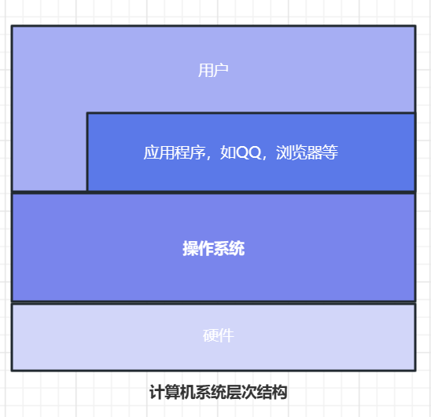
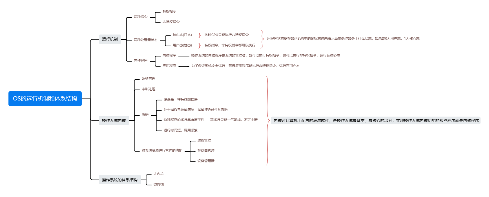
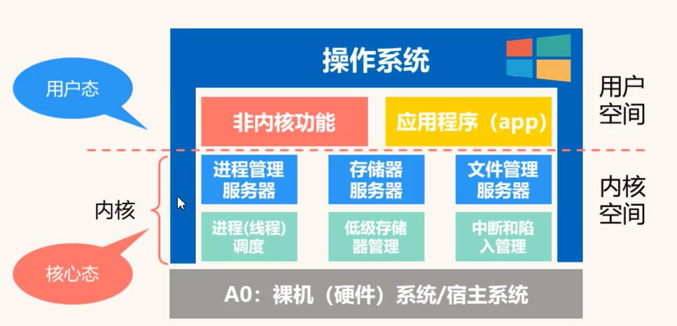
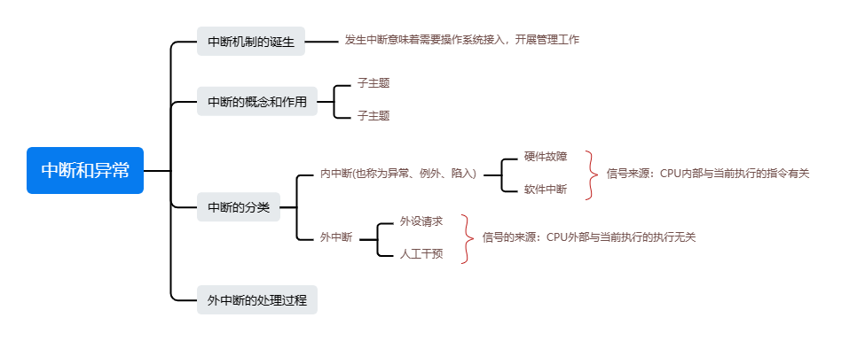
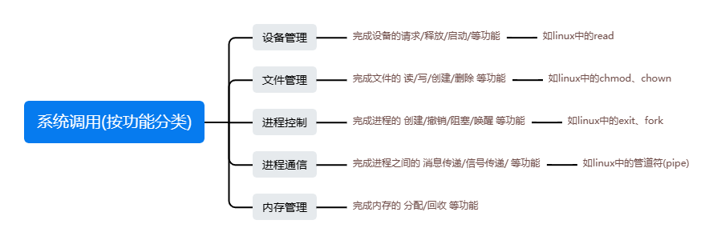
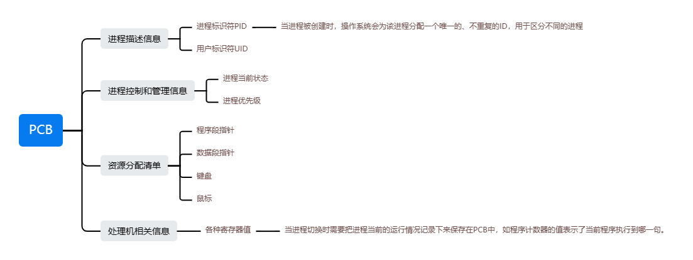
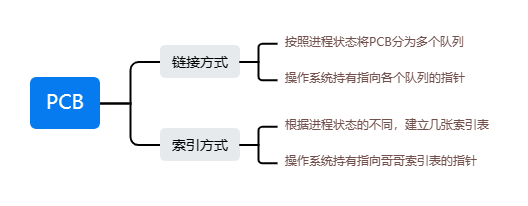
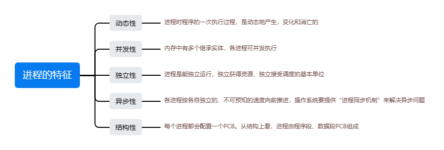
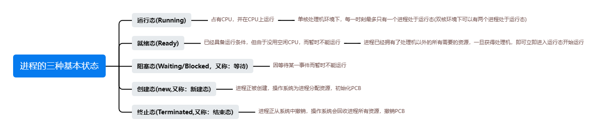
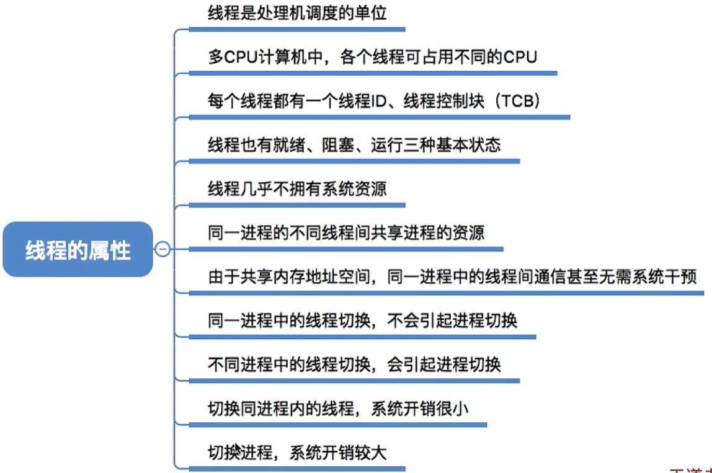

### 操作系统的概念

操作系统(operating System)是计算机系统中最基本的系统软件，负责控制和管理整个计算机系统的硬件和关键资源，并合理地组织调度计算机的工作和资源的分配，以提供给用户和其他软件方便的接口和环境。



> 操作系统负责管理协调硬件、软件等计算机资源工作
>
> 为 上层的应用程序、用户提供简单易用的服务

+ **操作系统的功能和目标------作为系统资源管理者**

  操作系统作为系统资源管理者要确保处理机管理、存储器管理、文件管理、设备管理安全高效的运行

  ```mermaid
  graph LR
  source[操作系统作为系统资源管理者的功能和目标]
  func[提供功能]
  target[目标]
  cpu[处理机管理]
  storage[存储器管理]
  file[文件管理]
  device[设备管理]
  to[安全高效]
  source-->func-->cpu
  func-->storage
  func-->file
  func-->device
  source-->target-->to
  ```

  + **操作系统的功能和目标------作为用户和计算机硬件之间的接口**

    

    ```mermaid
    graph LR
    source[作为用户和计算机硬件之间的接口]
    source-->提供功能
    提供功能-->命令接口
    提供功能-->程序接口
    提供功能-->GUI
    命令接口-->联机命令接口
    命令接口-->脱机命令接口
    source-->目标-->方便用户使用
    ```

    命令接口允许用户直接使用。

    > 联机命令接口(**交互式命令接口如cmd**)：用户说一句，系统做一句
    >
    > 脱机命令接口(**批处理命令接口如*.bat文件**)：用户说一堆，系统做一堆

    程序接口允许用户通过程序间接使用，由一组系统调用组成(程序接口=系统调用)

  ### 操作系统的特征

  > 操作系统的特征：**并发**、**共享**、**虚拟**、**异步**
  >
  > 并发和共享互为存在条件

  + 并发

    并发指的是两个或多个事件在同一事件间隔内发生。这些事件宏观上是同时发生的，但微观上是交替发生的。

    操作系统的并发性指计算机系统中同时存在着多个运行着的程序。

  + 共享

    共享即资源共享，是指系统中的资源可供内存中多个并发执行的进程共同使用。资源的共享方式有两种：互斥共享方式、同时共享方式

    互斥共享方式：系统中的某些资源，虽然可以提供给多个进程使用，但一个时间段内只允许一个进程访问该资源(如微信和QQ的视频聊天摄像头只能分配给一个进程)

    同时共享方式：系统中的某些资源，允许一个时间段内由多个进程"同时"对它们进行访问(例如微信和QQ同时读取磁盘中的数据)

    所谓的"同时"往往是宏观上的，而微观上，这些进程可能是交替地对该资源进行访问的(即分时共享)

  + 虚拟

    虚拟是指把一个物理上的实体变为若干个逻辑上的对应物。物理实体(前者)是实际存在的，而逻辑上对应物(后者)是用户感受到的。

    虚拟技术分为：空分复用技术(如虚拟存储器技术)、时分复用技术(如虚拟处理器)

  + 异步

    异步是指，在多道程序环境下，允许多个程序并发执行，由于资源有限，进程执行不是一贯到底的，而是走走停停的，以不可预知的速度向前推进，这就是进程的异步性。

### 操作系统的运行机制和体系结构




时钟管理：计时(提供系统事件)、时钟中断(进程切换)

中断处理：提高多道程序环境下CPU利用率

用户态和内核态的的切换的场景(程序申请外部资源时)：系统调用、中断、异常



原语：由若干条指令组成、用来完成某个特定功能、执行过程不会被中断

### 中断和异常

​	

+ 中断的概念和作用：

1. 当中断过程发生时，CPU立即进入核心态

2. 当中断发生，当前运行的进程暂停运行，并由操作系统内核对中断进行处理

3. 对于不同的中断信号，会进行不同的处理

4. 用户态转为核心态是通过**中断**实现的。并且中断是唯一途径

   发送了中断，就意味这需要操作系统介入，开展管理工作。由于操作系统的管理工作(比如进程切换、分配IO设备等)需要使用特权指令，因此CPU要从用户态转为核心态。中断可以使CPU要从用户态转为核心态。中断可以使CPU从用户切换为核心态，是操作系统获得计算机的控制权。有了中断，才实现躲到程序的并发执行。

+ 中断的分类

  内中断：

  1. 陷阱、陷入(trap)：有意而为之的异常，如系统调用，由程序主动引发
  2. 故障(fault)：由错误条件引起的，可能被故障处理程序修复，如缺页
  3. 终止(abort)：不可恢复的置命错误造成的结果，终止处理程序不再将控制返回给引发终止的应用程序，如整除0

  外中断

  ### 系统调用

  操作系统向上提供系统调用

  库和系统调用之间的关系：库可以看作是系统调用的一种封装

  应用程序通过系统调用请求操作系统的服务。系统中的各种共享资源都由操作系统统一掌控，因此在用户程序中，凡是与资源有关的操作(如存储分配、IO操作、文件管理等)，都必须通过系统调用的方式向操作系统提出服务请求，由操作系统代为完成。这样可以保证系统的稳定性和安全性，防止用户进行违法操作。

  

  系统调用相关处理涉及到对系统资源的管理、对进程的控制，这些功能需要执行一些特权指令才能完成，因此系统调用的相关处理需要在核心态下进行。(用户态转换至核心态)

  系统调用的背后过程：

  传递系统调用参数-->执行陷入指令(用户态)-->执行系统调用相应服务程序(核心态)-->返回用户程序

  1. 陷入指令是在用户态执行的，执行陷入指令之后立即引发一个内中断，从而CPU进入核心态

  2. 发出系统调用请求是在用户态，而对系统调用的相应处理在核心态下进行

  3. 陷入指令的唯一一个只能在用户态执行，而不可再核心态执行的指令

### 进程

**定义:**进程是进程实体的运行过程，是系统进行资源分配和调度的一个独立单位。

在内存中：程序的代码放在程序段内，程序运行过程处理的数据放在数据段内(如变量)。

为了方便操作系统管理，完成各程序并发执行，引入了进程、进程实体的概念。系统会为每个运行的程序配置一个数据结构，称为进程控制块(PCB)，用来描述进程的各种信息(如程序代码存放位置)。

PCB、程序段、数据段三部分构成了**进程实体(进程映像)**。一般情况下，我们把进程实体简称为进程，例如，所谓创建进程，实质上是创建实体进程中的PCB；而实质上是撤销进程实体中的PCB。**PCB是继承存在的唯一标志。**



从不同的角度，进程可有不同的定义，比较传统典型的定义有：

1. 进程是程序的一次执行过程
2. 进程是一个程序及其数据在处理机上顺序执行时所发生的所有活动。
3. 进程是具有独立功能的程序在数据集合上运行的过程；它是系统进行资源分配和资源调度的一个独立单位(基本单位)。

严格来说，进程实体和进程并不一样，进程实体是静态的，进程则是动态的。

进程的组织方式：



进程的特征：



### 进程的三种状态

进程是程序的一次执行。在这个执行过程中，有时进程正在被CPU处理，有时又需要等待CPU服务，可见，进程的状态是会有各种变化。为了方便对各进程的管理，操作系统需要将进程合理地划分为几种状态。

进程的三种基本状态：




### 进程的控制


### 进程通信


### 线程

线程的属性：

