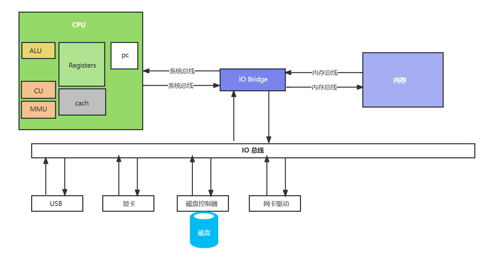

### 计算机结构原理图

PC(Program Counter)：程序计数器，当执行一条指令时，首先需要根据PC中存放的指令地址，将指令由内存取到[指令寄存器](https://baike.baidu.com/item/指令寄存器/3219483?fromModule=lemma_inlink)中，此过程称为“取指令”。与此同时，PC中的地址或自动加1或由转移指针给出下一条指令的地址。此后经过分析指令，执行指令。完成第一条指令的执行，而后根据PC取出第二条指令的地址，如此循环，执行每一条指令。

Registers：暂时存储CPU计算需要用到的数据

ALU：运算单元

CU：控制单元

MMU(Memory Management Unit)：内存管理单元

cache：

